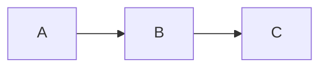

# Documentazione Kanban AI

Questa documentazione è generata con [MkDocs](https://www.mkdocs.org/) e il tema [Material for MkDocs](https://squidfunk.github.io/mkdocs-material/).

## Installazione

```bash
pip install mkdocs mkdocs-material mkdocs-mermaid2-plugin
```

## Comandi

```bash
# Dalla root del progetto

# Avvia server di sviluppo (hot reload su http://127.0.0.1:8000)
mkdocs serve

# Genera sito statico in ./site/
mkdocs build

# Deploy su GitHub Pages
mkdocs gh-deploy
```

## Struttura

```
docs/
├── index.md              # Home page
├── getting-started/      # Installazione e quick start
├── architecture/         # Architettura del progetto
├── dspy-guide/           # Guida DSPy e AI agent
├── api-reference/        # Documentazione API
├── user-guide/           # Guida utente
└── development/          # Guida per sviluppatori

mkdocs.yml                # Configurazione MkDocs
```

## Modificare la documentazione

1. Modifica i file `.md` in `docs/`
2. Il server `mkdocs serve` ricarica automaticamente
3. Per aggiungere pagine, modifica la sezione `nav:` in `mkdocs.yml`

## Mermaid diagrams

I diagrammi Mermaid sono supportati:

````markdown

````
