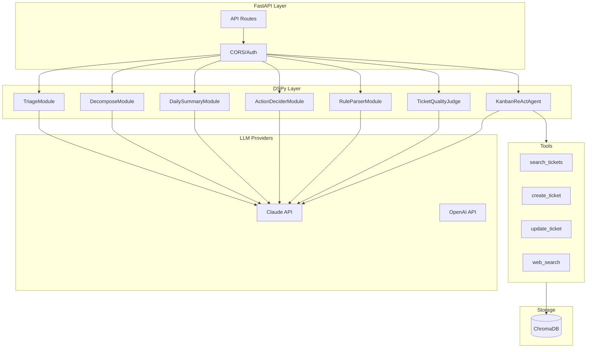

# AI Agent Architecture

L'agent AI di Kanban AI e un servizio Python basato su FastAPI e DSPy.

## Overview



## Struttura Directory

```
services/agent/
├── src/
│   ├── __init__.py
│   ├── main.py              # FastAPI app entry
│   ├── config.py            # Settings (pydantic)
│   │
│   ├── api/                 # REST API layer
│   │   ├── __init__.py
│   │   ├── routes.py        # All endpoints
│   │   └── models.py        # Request/Response types
│   │
│   ├── agent/               # DSPy modules
│   │   ├── __init__.py
│   │   ├── modules.py       # Core modules (Triage, etc.)
│   │   ├── react_agent.py   # ReAct agent
│   │   ├── judge.py         # Quality judge
│   │   ├── tools.py         # Tool definitions
│   │   ├── cache.py         # Response caching
│   │   ├── analytics.py     # Usage analytics
│   │   ├── suggester.py     # Proactive suggestions
│   │   └── multihop.py      # Multi-hop reasoning
│   │
│   └── db/                  # Database layer
│       ├── __init__.py
│       └── chroma.py        # ChromaDB operations
│
├── tests/                   # Test suite
│   ├── conftest.py
│   ├── test_api.py
│   ├── test_modules.py
│   └── test_chroma.py
│
├── examples/                # Usage examples
│   └── basic_usage.py
│
├── data/                    # Runtime data
│   └── chroma/              # Vector DB storage
│
├── pyproject.toml           # Dependencies
└── .env                     # Environment config
```

## FastAPI Application

### Entry Point

```python
# main.py
from contextlib import asynccontextmanager
from fastapi import FastAPI
from fastapi.middleware.cors import CORSMiddleware
import dspy

from .config import settings
from .api.routes import router


@asynccontextmanager
async def lifespan(app: FastAPI):
    """Initialize resources on startup."""
    setup_dspy()
    yield
    # Cleanup on shutdown


def setup_dspy():
    """Configure DSPy with LLM provider."""
    if settings.llm_provider == "anthropic":
        lm = dspy.LM(
            model=f"anthropic/{settings.default_model}",
            api_key=settings.anthropic_api_key,
            temperature=0.7,
            max_tokens=2048,
        )
    else:
        lm = dspy.LM(
            model=f"openai/{settings.default_model}",
            api_key=settings.openai_api_key,
            temperature=0.7,
            max_tokens=2048,
        )
    dspy.configure(lm=lm)


app = FastAPI(
    title="Kanban AI Agent",
    version="0.1.0",
    lifespan=lifespan,
)

app.add_middleware(
    CORSMiddleware,
    allow_origins=["http://localhost:5173", "tauri://localhost"],
    allow_methods=["*"],
    allow_headers=["*"],
)

app.include_router(router)
```

### API Routes

```python
# api/routes.py
from fastapi import APIRouter, HTTPException
from .models import *
from ..agent.modules import TriageModule, DecomposeModule, DailySummaryModule
from ..agent.react_agent import KanbanReActAgent

router = APIRouter(prefix="/api")

# Module instances
triage_module = TriageModule()
decompose_module = DecomposeModule()
summary_module = DailySummaryModule()
react_agent = KanbanReActAgent()


@router.post("/triage", response_model=TriageResponse)
async def triage_ticket(request: TriageRequest):
    """Automatically triage a ticket."""
    try:
        result = triage_module(
            title=request.title,
            description=request.description,
            existing_labels=request.existing_labels or [],
        )
        return TriageResponse(
            priority=result.priority,
            labels=result.labels,
            effort=result.effort_estimate,
            reasoning=result.reasoning,
        )
    except Exception as e:
        raise HTTPException(500, str(e))


@router.post("/decompose", response_model=DecomposeResponse)
async def decompose_ticket(request: DecomposeRequest):
    """Decompose a ticket into subtasks."""
    try:
        result = decompose_module(
            title=request.title,
            description=request.description,
            context=request.context or "",
        )
        return DecomposeResponse(
            subtasks=result.subtasks,
            dependencies=result.dependencies,
            reasoning=result.reasoning,
        )
    except Exception as e:
        raise HTTPException(500, str(e))


@router.get("/daily-summary", response_model=DailySummaryResponse)
async def get_daily_summary(
    in_progress: list[dict] = [],
    blocked: list[dict] = [],
    due_soon: list[dict] = [],
):
    """Generate a daily summary."""
    try:
        result = summary_module(
            in_progress=in_progress,
            blocked=blocked,
            due_soon=due_soon,
        )
        return DailySummaryResponse(
            greeting=result.greeting,
            focus_today=result.focus_today,
            blockers=result.blockers,
            quick_wins=result.quick_wins,
        )
    except Exception as e:
        raise HTTPException(500, str(e))


@router.post("/chat", response_model=ChatResponse)
async def chat(request: ChatRequest):
    """Process a chat message."""
    try:
        result = react_agent(question=request.message)
        return ChatResponse(
            answer=result["answer"],
            trajectory=result.get("trajectory", []),
        )
    except Exception as e:
        raise HTTPException(500, str(e))


@router.get("/health")
async def health_check():
    """Health check endpoint."""
    return {"status": "healthy", "model": settings.default_model}
```

## DSPy Modules

### Module Pattern

```python
# agent/modules.py
import dspy
from typing import Literal


class TriageTicket(dspy.Signature):
    """Analyze a ticket and assign metadata."""

    title: str = dspy.InputField()
    description: str = dspy.InputField()
    existing_labels: list[str] = dspy.InputField()

    priority: Literal["low", "medium", "high", "critical"] = dspy.OutputField()
    labels: list[str] = dspy.OutputField()
    effort_estimate: Literal["xs", "s", "m", "l", "xl"] = dspy.OutputField()
    reasoning: str = dspy.OutputField()


class TriageModule(dspy.Module):
    def __init__(self):
        super().__init__()
        self.triage = dspy.ChainOfThought(TriageTicket)

    def forward(self, title: str, description: str, existing_labels: list[str]):
        result = self.triage(
            title=title,
            description=description,
            existing_labels=existing_labels,
        )

        # Validate output
        dspy.Assert(
            result.priority in ("low", "medium", "high", "critical"),
            f"Invalid priority: {result.priority}"
        )

        return result
```

### ReAct Agent

```python
# agent/react_agent.py
import dspy
from .tools import search_tickets, create_ticket, update_ticket, web_search


class KanbanReActAgent(dspy.Module):
    """ReAct agent with tool usage."""

    def __init__(self, max_iters: int = 5):
        super().__init__()
        self.react = dspy.ReAct(
            signature="question, board_context -> answer",
            tools=[search_tickets, create_ticket, update_ticket, web_search],
            max_iters=max_iters,
        )

    def forward(self, question: str) -> dict:
        context = get_board_context()
        result = self.react(question=question, board_context=str(context))
        return {
            "answer": result.answer,
            "trajectory": getattr(result, "trajectory", []),
        }
```

### Tools

```python
# agent/tools.py
import dspy
from ..db.chroma import ChromaDB

db = ChromaDB()


@dspy.tool
def search_tickets(query: str) -> str:
    """Search for tickets matching the query.

    Args:
        query: Search query (natural language or keywords)

    Returns:
        JSON string of matching tickets
    """
    results = db.search(query, limit=5)
    return json.dumps(results)


@dspy.tool
def create_ticket(title: str, description: str = "") -> str:
    """Create a new ticket.

    Args:
        title: Ticket title
        description: Optional description

    Returns:
        JSON string of created ticket
    """
    ticket = {
        "id": str(uuid.uuid4()),
        "title": title,
        "description": description,
        "status": "todo",
        "created_at": datetime.now().isoformat(),
    }
    db.add_ticket(ticket)
    return json.dumps(ticket)


@dspy.tool
def update_ticket(ticket_id: str, updates: dict) -> str:
    """Update an existing ticket.

    Args:
        ticket_id: ID of ticket to update
        updates: Dict of fields to update

    Returns:
        JSON string of updated ticket
    """
    ticket = db.get_ticket(ticket_id)
    if not ticket:
        return json.dumps({"error": "Ticket not found"})

    ticket.update(updates)
    db.update_ticket(ticket_id, ticket)
    return json.dumps(ticket)


@dspy.tool
def web_search(query: str) -> str:
    """Search the web for information.

    Args:
        query: Search query

    Returns:
        Search results as string
    """
    from duckduckgo_search import DDGS

    with DDGS() as ddgs:
        results = list(ddgs.text(query, max_results=3))
    return json.dumps(results)
```

## ChromaDB Integration

```python
# db/chroma.py
import chromadb
from chromadb.config import Settings


class ChromaDB:
    def __init__(self, path: str = "./data/chroma"):
        self.client = chromadb.PersistentClient(
            path=path,
            settings=Settings(anonymized_telemetry=False),
        )
        self.collection = self.client.get_or_create_collection(
            name="tickets",
            metadata={"hnsw:space": "cosine"},
        )

    def add_ticket(self, ticket: dict):
        """Add a ticket to the vector store."""
        text = f"{ticket['title']} {ticket.get('description', '')}"
        self.collection.add(
            ids=[ticket["id"]],
            documents=[text],
            metadatas=[{
                "title": ticket["title"],
                "status": ticket.get("status", "todo"),
                "priority": ticket.get("priority", "medium"),
            }],
        )

    def search(self, query: str, limit: int = 5) -> list[dict]:
        """Semantic search for tickets."""
        results = self.collection.query(
            query_texts=[query],
            n_results=limit,
            include=["documents", "metadatas", "distances"],
        )

        tickets = []
        for i, id_ in enumerate(results["ids"][0]):
            tickets.append({
                "id": id_,
                "title": results["metadatas"][0][i]["title"],
                "score": 1 - results["distances"][0][i],  # Convert distance to similarity
            })
        return tickets

    def get_ticket(self, ticket_id: str) -> dict | None:
        """Get a ticket by ID."""
        results = self.collection.get(ids=[ticket_id])
        if not results["ids"]:
            return None
        return {
            "id": results["ids"][0],
            "text": results["documents"][0],
            **results["metadatas"][0],
        }

    def update_ticket(self, ticket_id: str, ticket: dict):
        """Update a ticket in the vector store."""
        text = f"{ticket['title']} {ticket.get('description', '')}"
        self.collection.update(
            ids=[ticket_id],
            documents=[text],
            metadatas=[{
                "title": ticket["title"],
                "status": ticket.get("status", "todo"),
                "priority": ticket.get("priority", "medium"),
            }],
        )

    def delete_ticket(self, ticket_id: str):
        """Delete a ticket from the vector store."""
        self.collection.delete(ids=[ticket_id])
```

## Configuration

```python
# config.py
from pydantic_settings import BaseSettings


class AgentSettings(BaseSettings):
    # LLM
    anthropic_api_key: str | None = None
    openai_api_key: str | None = None
    llm_provider: str = "openai"
    default_model: str = "gpt-4o-mini"

    # Embedding
    embedding_model: str = "text-embedding-3-small"

    # Database
    chroma_path: str = "./data/chroma"

    # Server
    host: str = "127.0.0.1"
    port: int = 8765
    debug: bool = False

    # Behavior
    auto_triage_enabled: bool = True
    max_decompose_subtasks: int = 7

    class Config:
        env_file = ".env"


settings = AgentSettings()
```

## Testing

```python
# tests/test_modules.py
import pytest
import dspy
from agent.modules import TriageModule


@pytest.fixture
def triage_module():
    # Setup mock LM for testing
    dspy.configure(lm=dspy.LM("openai/gpt-4o-mini"))
    return TriageModule()


def test_triage_urgent_ticket(triage_module):
    result = triage_module(
        title="URGENT: Production down",
        description="Main API not responding",
        existing_labels=["bug", "urgent", "infra"],
    )

    assert result.priority in ("high", "critical")
    assert isinstance(result.labels, list)
    assert result.effort_estimate in ("xs", "s", "m", "l", "xl")


def test_triage_feature_request(triage_module):
    result = triage_module(
        title="Add dark mode",
        description="Users want dark mode option",
        existing_labels=["feature", "ui"],
    )

    assert result.priority in ("low", "medium")
    assert "feature" in result.labels or "ui" in result.labels
```

## Error Handling

```python
# api/routes.py
from fastapi import HTTPException
from enum import Enum


class ErrorCode(Enum):
    LLM_ERROR = "llm_error"
    RATE_LIMITED = "rate_limited"
    INVALID_INPUT = "invalid_input"
    NOT_FOUND = "not_found"


class AgentException(Exception):
    def __init__(self, code: ErrorCode, message: str, details: dict = None):
        self.code = code
        self.message = message
        self.details = details or {}


@app.exception_handler(AgentException)
async def agent_exception_handler(request, exc: AgentException):
    return JSONResponse(
        status_code=400,
        content={
            "error": exc.code.value,
            "message": exc.message,
            "details": exc.details,
        },
    )
```

## Running the Agent

```bash
# Development
cd services/agent
uv run fastapi dev

# Production
uv run uvicorn src.main:app --host 0.0.0.0 --port 8765
```
