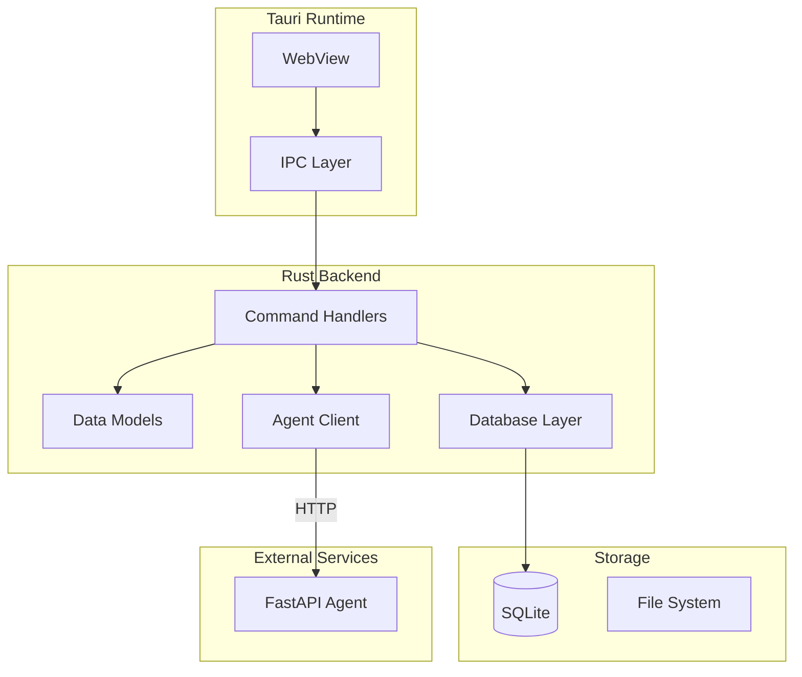

# Backend Architecture

Il backend di Kanban AI e scritto in Rust usando Tauri 2.0.

## Overview



## Struttura Directory

```
src-tauri/
├── src/
│   ├── main.rs             # Entry point, app setup
│   ├── lib.rs              # Library exports
│   │
│   ├── commands/           # IPC command handlers
│   │   ├── mod.rs
│   │   ├── tickets.rs      # Ticket CRUD
│   │   ├── board.rs        # Board operations
│   │   ├── search.rs       # Search functionality
│   │   └── ai.rs           # AI agent calls
│   │
│   ├── models/             # Data structures
│   │   ├── mod.rs
│   │   ├── ticket.rs       # Ticket model
│   │   ├── board.rs        # Board/column models
│   │   └── api.rs          # API request/response types
│   │
│   ├── db/                 # Database operations
│   │   ├── mod.rs
│   │   ├── connection.rs   # SQLite connection
│   │   ├── migrations.rs   # Schema migrations
│   │   └── queries.rs      # SQL queries
│   │
│   ├── agent/              # Agent client
│   │   ├── mod.rs
│   │   ├── client.rs       # HTTP client
│   │   └── types.rs        # Agent API types
│   │
│   └── utils/              # Utilities
│       ├── mod.rs
│       └── error.rs        # Error handling
│
├── Cargo.toml              # Dependencies
├── tauri.conf.json         # Tauri configuration
└── build.rs                # Build script
```

## Data Models

### Ticket

```rust
// models/ticket.rs
use serde::{Deserialize, Serialize};
use chrono::{DateTime, Utc};

#[derive(Debug, Clone, Serialize, Deserialize)]
pub struct Ticket {
    pub id: String,
    pub title: String,
    pub description: Option<String>,
    pub status: TicketStatus,
    pub priority: Priority,
    pub labels: Vec<String>,
    pub effort: Option<Effort>,
    pub column_id: String,
    pub position: i32,
    pub created_at: DateTime<Utc>,
    pub updated_at: DateTime<Utc>,
    pub due_date: Option<DateTime<Utc>>,
}

#[derive(Debug, Clone, Serialize, Deserialize)]
#[serde(rename_all = "lowercase")]
pub enum TicketStatus {
    Backlog,
    Todo,
    InProgress,
    Review,
    Done,
}

#[derive(Debug, Clone, Serialize, Deserialize)]
#[serde(rename_all = "lowercase")]
pub enum Priority {
    Low,
    Medium,
    High,
    Critical,
}

#[derive(Debug, Clone, Serialize, Deserialize)]
#[serde(rename_all = "lowercase")]
pub enum Effort {
    Xs,
    S,
    M,
    L,
    Xl,
}
```

### Board

```rust
// models/board.rs
#[derive(Debug, Clone, Serialize, Deserialize)]
pub struct Board {
    pub id: String,
    pub name: String,
    pub columns: Vec<Column>,
    pub created_at: DateTime<Utc>,
}

#[derive(Debug, Clone, Serialize, Deserialize)]
pub struct Column {
    pub id: String,
    pub name: String,
    pub position: i32,
    pub color: Option<String>,
    pub wip_limit: Option<i32>,
}
```

## IPC Commands

### Command Definition

```rust
// commands/tickets.rs
use tauri::command;
use crate::models::{Ticket, CreateTicketRequest};
use crate::db::Database;

#[command]
pub async fn create_ticket(
    db: tauri::State<'_, Database>,
    data: CreateTicketRequest,
) -> Result<Ticket, String> {
    let ticket = Ticket::new(data);

    db.insert_ticket(&ticket)
        .await
        .map_err(|e| e.to_string())?;

    Ok(ticket)
}

#[command]
pub async fn get_tickets(
    db: tauri::State<'_, Database>,
) -> Result<Vec<Ticket>, String> {
    db.get_all_tickets()
        .await
        .map_err(|e| e.to_string())
}

#[command]
pub async fn update_ticket(
    db: tauri::State<'_, Database>,
    id: String,
    updates: UpdateTicketRequest,
) -> Result<Ticket, String> {
    db.update_ticket(&id, updates)
        .await
        .map_err(|e| e.to_string())
}

#[command]
pub async fn delete_ticket(
    db: tauri::State<'_, Database>,
    id: String,
) -> Result<(), String> {
    db.delete_ticket(&id)
        .await
        .map_err(|e| e.to_string())
}
```

### Registration

```rust
// main.rs
fn main() {
    tauri::Builder::default()
        .manage(Database::new())
        .invoke_handler(tauri::generate_handler![
            commands::tickets::create_ticket,
            commands::tickets::get_tickets,
            commands::tickets::update_ticket,
            commands::tickets::delete_ticket,
            commands::board::get_board,
            commands::board::move_ticket,
            commands::ai::triage_ticket,
            commands::ai::chat,
            commands::search::search_tickets,
        ])
        .run(tauri::generate_context!())
        .expect("error while running tauri application");
}
```

## Database Layer

### Connection Pool

```rust
// db/connection.rs
use rusqlite::{Connection, params};
use std::sync::Mutex;

pub struct Database {
    conn: Mutex<Connection>,
}

impl Database {
    pub fn new() -> Self {
        let conn = Connection::open("kanban.db")
            .expect("Failed to open database");

        Self::run_migrations(&conn);

        Database {
            conn: Mutex::new(conn),
        }
    }

    fn run_migrations(conn: &Connection) {
        conn.execute_batch(include_str!("migrations/001_initial.sql"))
            .expect("Failed to run migrations");
    }
}
```

### Migrations

```sql
-- db/migrations/001_initial.sql

CREATE TABLE IF NOT EXISTS boards (
    id TEXT PRIMARY KEY,
    name TEXT NOT NULL,
    created_at TEXT NOT NULL DEFAULT (datetime('now'))
);

CREATE TABLE IF NOT EXISTS columns (
    id TEXT PRIMARY KEY,
    board_id TEXT NOT NULL,
    name TEXT NOT NULL,
    position INTEGER NOT NULL,
    color TEXT,
    wip_limit INTEGER,
    FOREIGN KEY (board_id) REFERENCES boards(id)
);

CREATE TABLE IF NOT EXISTS tickets (
    id TEXT PRIMARY KEY,
    title TEXT NOT NULL,
    description TEXT,
    status TEXT NOT NULL DEFAULT 'todo',
    priority TEXT NOT NULL DEFAULT 'medium',
    labels TEXT, -- JSON array
    effort TEXT,
    column_id TEXT NOT NULL,
    position INTEGER NOT NULL,
    created_at TEXT NOT NULL DEFAULT (datetime('now')),
    updated_at TEXT NOT NULL DEFAULT (datetime('now')),
    due_date TEXT,
    FOREIGN KEY (column_id) REFERENCES columns(id)
);

CREATE INDEX idx_tickets_column ON tickets(column_id);
CREATE INDEX idx_tickets_status ON tickets(status);
CREATE INDEX idx_tickets_priority ON tickets(priority);

-- Full-text search
CREATE VIRTUAL TABLE IF NOT EXISTS tickets_fts USING fts5(
    title,
    description,
    content='tickets',
    content_rowid='rowid'
);
```

### Query Methods

```rust
// db/queries.rs
impl Database {
    pub async fn get_all_tickets(&self) -> Result<Vec<Ticket>> {
        let conn = self.conn.lock().unwrap();
        let mut stmt = conn.prepare(
            "SELECT * FROM tickets ORDER BY column_id, position"
        )?;

        let tickets = stmt.query_map([], |row| {
            Ok(Ticket {
                id: row.get(0)?,
                title: row.get(1)?,
                description: row.get(2)?,
                status: row.get::<_, String>(3)?.parse().unwrap(),
                priority: row.get::<_, String>(4)?.parse().unwrap(),
                labels: serde_json::from_str(&row.get::<_, String>(5)?).unwrap_or_default(),
                effort: row.get::<_, Option<String>>(6)?.map(|e| e.parse().unwrap()),
                column_id: row.get(7)?,
                position: row.get(8)?,
                created_at: row.get(9)?,
                updated_at: row.get(10)?,
                due_date: row.get(11)?,
            })
        })?
        .collect::<Result<Vec<_>, _>>()?;

        Ok(tickets)
    }

    pub async fn insert_ticket(&self, ticket: &Ticket) -> Result<()> {
        let conn = self.conn.lock().unwrap();
        conn.execute(
            "INSERT INTO tickets (id, title, description, status, priority, labels, effort, column_id, position, created_at, updated_at, due_date)
             VALUES (?1, ?2, ?3, ?4, ?5, ?6, ?7, ?8, ?9, ?10, ?11, ?12)",
            params![
                ticket.id,
                ticket.title,
                ticket.description,
                ticket.status.to_string(),
                ticket.priority.to_string(),
                serde_json::to_string(&ticket.labels)?,
                ticket.effort.as_ref().map(|e| e.to_string()),
                ticket.column_id,
                ticket.position,
                ticket.created_at.to_rfc3339(),
                ticket.updated_at.to_rfc3339(),
                ticket.due_date.map(|d| d.to_rfc3339()),
            ],
        )?;
        Ok(())
    }

    pub async fn search_tickets(&self, query: &str) -> Result<Vec<Ticket>> {
        let conn = self.conn.lock().unwrap();
        let mut stmt = conn.prepare(
            "SELECT t.* FROM tickets t
             JOIN tickets_fts f ON t.rowid = f.rowid
             WHERE tickets_fts MATCH ?1
             ORDER BY rank"
        )?;

        // ... query execution
    }
}
```

## Agent Client

### HTTP Client

```rust
// agent/client.rs
use reqwest::Client;
use crate::agent::types::*;

pub struct AgentClient {
    client: Client,
    base_url: String,
}

impl AgentClient {
    pub fn new(base_url: &str) -> Self {
        AgentClient {
            client: Client::new(),
            base_url: base_url.to_string(),
        }
    }

    pub async fn triage(&self, request: TriageRequest) -> Result<TriageResponse> {
        let response = self.client
            .post(format!("{}/api/triage", self.base_url))
            .json(&request)
            .send()
            .await?
            .json::<TriageResponse>()
            .await?;

        Ok(response)
    }

    pub async fn chat(&self, request: ChatRequest) -> Result<ChatResponse> {
        let response = self.client
            .post(format!("{}/api/chat", self.base_url))
            .json(&request)
            .send()
            .await?
            .json::<ChatResponse>()
            .await?;

        Ok(response)
    }

    pub async fn decompose(&self, ticket_id: &str) -> Result<DecomposeResponse> {
        let response = self.client
            .post(format!("{}/api/decompose", self.base_url))
            .json(&serde_json::json!({ "ticket_id": ticket_id }))
            .send()
            .await?
            .json::<DecomposeResponse>()
            .await?;

        Ok(response)
    }
}
```

### AI Commands

```rust
// commands/ai.rs
use tauri::command;
use crate::agent::AgentClient;

#[command]
pub async fn triage_ticket(
    agent: tauri::State<'_, AgentClient>,
    db: tauri::State<'_, Database>,
    ticket_id: String,
) -> Result<TriageResponse, String> {
    // Get ticket from DB
    let ticket = db.get_ticket(&ticket_id)
        .await
        .map_err(|e| e.to_string())?;

    // Call agent
    let triage = agent.triage(TriageRequest {
        title: ticket.title,
        description: ticket.description.unwrap_or_default(),
        existing_labels: db.get_all_labels().await.unwrap_or_default(),
    })
    .await
    .map_err(|e| e.to_string())?;

    // Update ticket with triage results
    db.update_ticket(&ticket_id, UpdateTicketRequest {
        priority: Some(triage.priority.clone()),
        labels: Some(triage.labels.clone()),
        effort: Some(triage.effort.clone()),
    })
    .await
    .map_err(|e| e.to_string())?;

    Ok(triage)
}

#[command]
pub async fn chat(
    agent: tauri::State<'_, AgentClient>,
    db: tauri::State<'_, Database>,
    message: String,
) -> Result<ChatResponse, String> {
    let tickets = db.get_all_tickets().await.unwrap_or_default();

    agent.chat(ChatRequest {
        message,
        context: ChatContext {
            tickets,
            current_view: "board".to_string(),
        },
    })
    .await
    .map_err(|e| e.to_string())
}
```

## Error Handling

```rust
// utils/error.rs
use thiserror::Error;

#[derive(Error, Debug)]
pub enum AppError {
    #[error("Database error: {0}")]
    Database(#[from] rusqlite::Error),

    #[error("Agent error: {0}")]
    Agent(#[from] reqwest::Error),

    #[error("Serialization error: {0}")]
    Serialization(#[from] serde_json::Error),

    #[error("Not found: {0}")]
    NotFound(String),

    #[error("Invalid input: {0}")]
    InvalidInput(String),
}

impl From<AppError> for String {
    fn from(error: AppError) -> Self {
        error.to_string()
    }
}
```

## Configuration

### tauri.conf.json

```json
{
  "$schema": "https://schema.tauri.app/config/2",
  "productName": "Kanban AI",
  "version": "0.1.0",
  "identifier": "com.kanban-ai.app",
  "build": {
    "beforeBuildCommand": "pnpm build",
    "beforeDevCommand": "pnpm dev",
    "frontendDist": "../dist",
    "devUrl": "http://localhost:5173"
  },
  "app": {
    "windows": [
      {
        "title": "Kanban AI",
        "width": 1200,
        "height": 800,
        "minWidth": 800,
        "minHeight": 600,
        "resizable": true
      }
    ],
    "security": {
      "csp": "default-src 'self'; connect-src 'self' http://localhost:8765"
    }
  },
  "plugins": {
    "shell": {
      "open": true
    }
  }
}
```

### Cargo.toml

```toml
[package]
name = "kanban-ai"
version = "0.1.0"
edition = "2021"

[dependencies]
tauri = { version = "2", features = ["protocol-asset"] }
serde = { version = "1", features = ["derive"] }
serde_json = "1"
rusqlite = { version = "0.31", features = ["bundled"] }
reqwest = { version = "0.12", features = ["json"] }
tokio = { version = "1", features = ["full"] }
chrono = { version = "0.4", features = ["serde"] }
uuid = { version = "1", features = ["v4", "serde"] }
thiserror = "1"

[build-dependencies]
tauri-build = { version = "2", features = [] }
```
