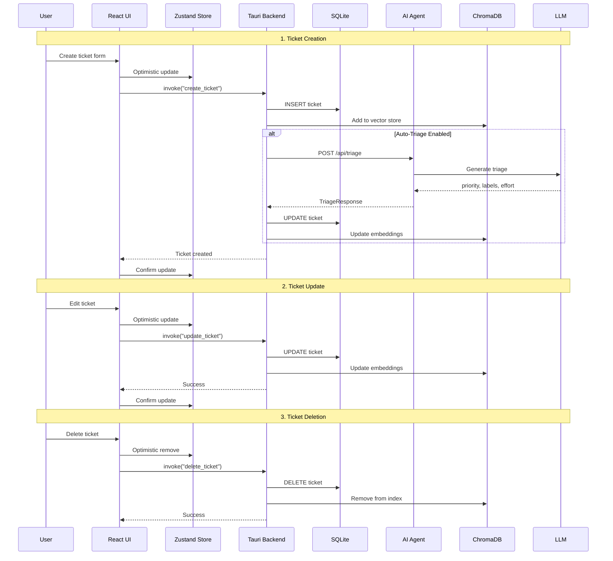
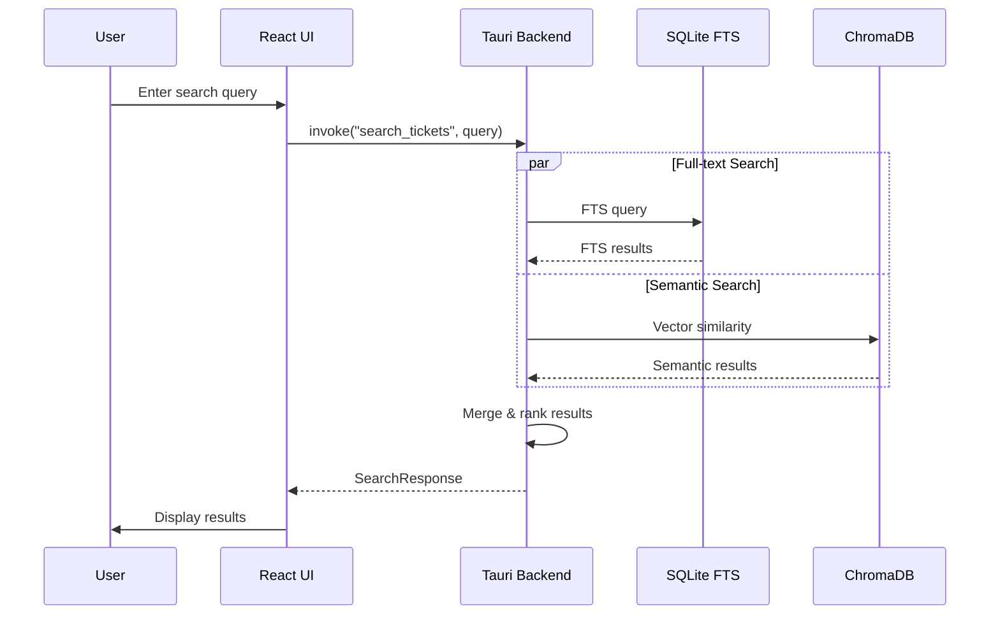
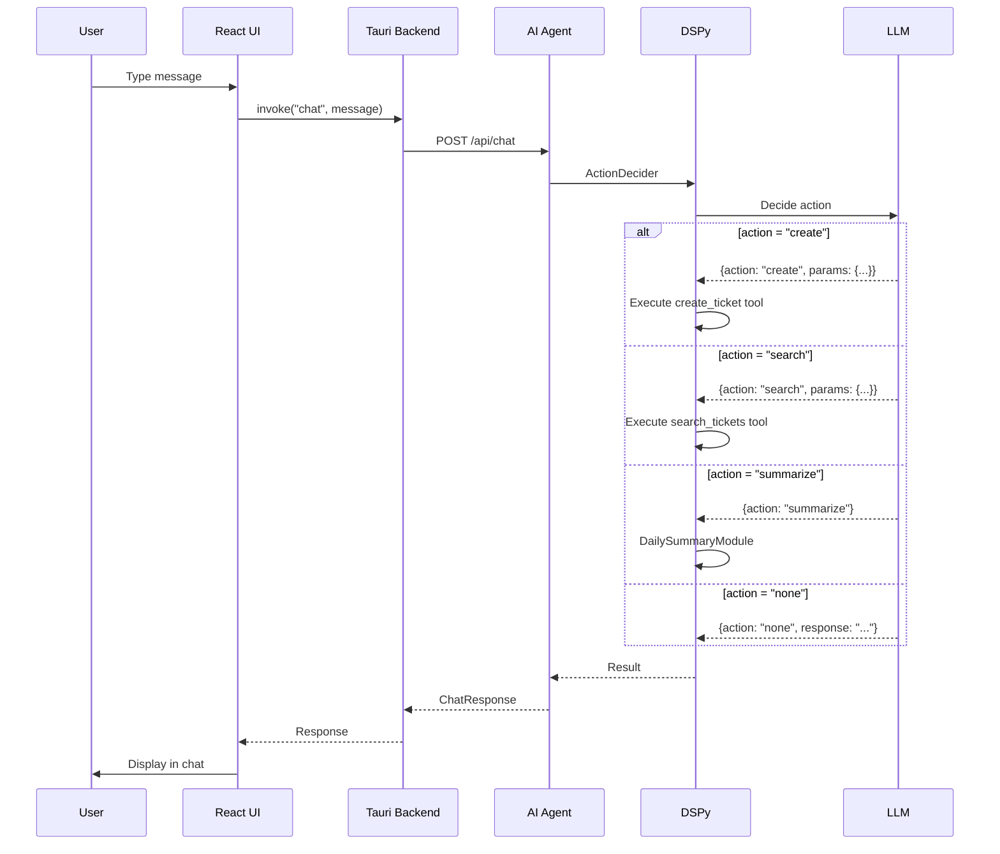
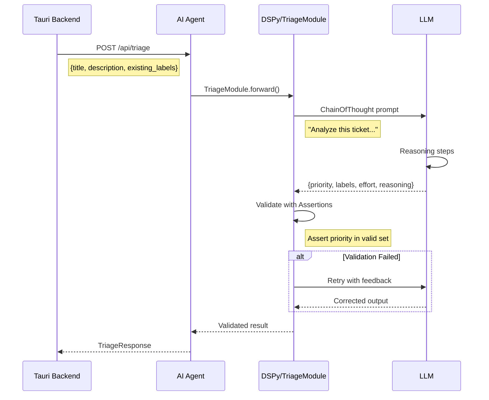
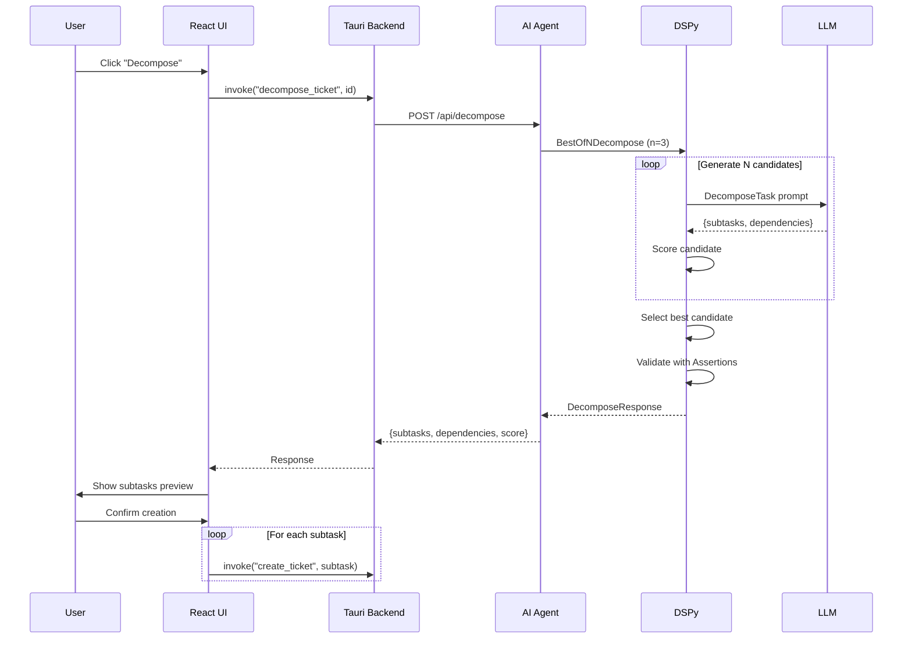
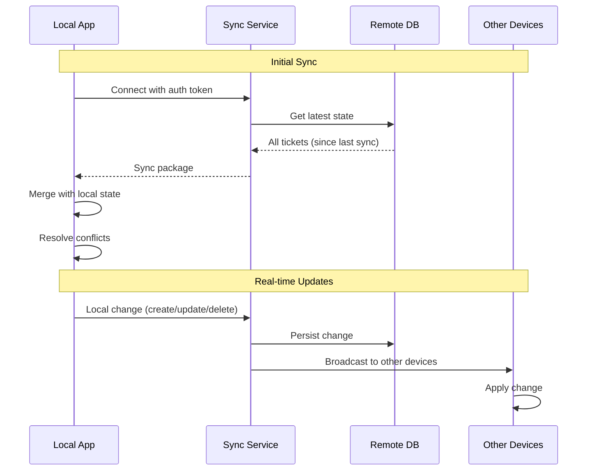
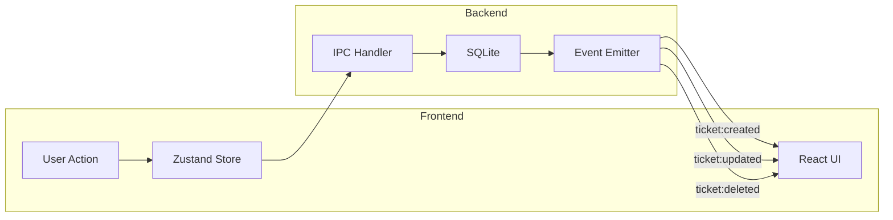
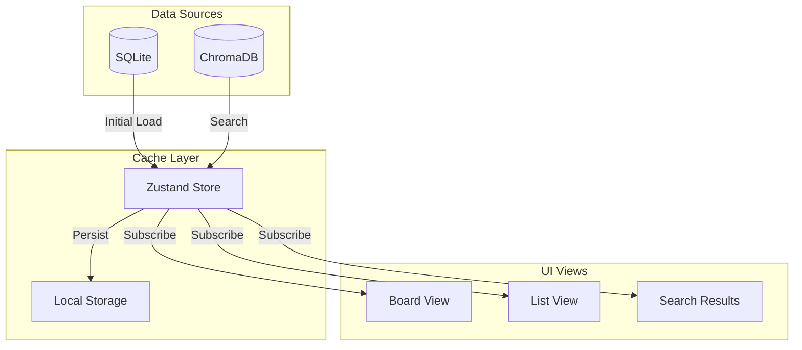

# Data Flow

Questa pagina descrive i flussi di dati principali in Kanban AI.

## Ticket Lifecycle



## Search Flow



### Search Ranking

```
Final Score = (0.6 × FTS Score) + (0.4 × Semantic Score) + Recency Boost

Where:
- FTS Score: BM25 relevance from SQLite FTS5
- Semantic Score: Cosine similarity from ChromaDB
- Recency Boost: +0.1 for tickets modified in last 7 days
```

## AI Chat Flow



## Auto-Triage Flow



## Decomposition Flow



## Sync Flow (Future)



## Event Flow



### Event Types

| Event | Payload | Trigger |
|-------|---------|---------|
| `ticket:created` | `Ticket` | New ticket saved |
| `ticket:updated` | `{id, changes}` | Ticket modified |
| `ticket:deleted` | `{id}` | Ticket removed |
| `ticket:moved` | `{id, from, to}` | Column changed |
| `board:updated` | `Board` | Board structure changed |
| `ai:triage_complete` | `{ticketId, result}` | Auto-triage finished |

## State Synchronization



### Optimistic Updates

```typescript
// Pattern for optimistic updates

async function updateTicket(id: string, changes: Partial<Ticket>) {
  // 1. Save current state for rollback
  const previousTickets = store.getState().tickets

  // 2. Optimistically update UI
  store.setState({
    tickets: tickets.map(t =>
      t.id === id ? { ...t, ...changes } : t
    )
  })

  try {
    // 3. Persist to backend
    await invoke('update_ticket', { id, changes })
  } catch (error) {
    // 4. Rollback on failure
    store.setState({ tickets: previousTickets })
    toast.error('Failed to update ticket')
  }
}
```

## Caching Strategy

### Frontend Cache

```typescript
// Zustand with persistence
const useTicketStore = create(
  persist(
    (set, get) => ({
      tickets: [],
      lastFetch: null,

      fetchTickets: async () => {
        // Check cache freshness (5 min)
        const now = Date.now()
        if (get().lastFetch && now - get().lastFetch < 300000) {
          return // Use cached data
        }

        const tickets = await invoke('get_tickets')
        set({ tickets, lastFetch: now })
      },
    }),
    {
      name: 'ticket-cache',
      partialize: (state) => ({
        tickets: state.tickets,
        lastFetch: state.lastFetch,
      }),
    }
  )
)
```

### Backend Cache

```rust
// LRU cache for frequent queries
use lru::LruCache;

struct QueryCache {
    cache: Mutex<LruCache<String, Vec<Ticket>>>,
    ttl: Duration,
}

impl QueryCache {
    fn get(&self, key: &str) -> Option<Vec<Ticket>> {
        let mut cache = self.cache.lock().unwrap();
        cache.get(key).cloned()
    }

    fn set(&self, key: String, value: Vec<Ticket>) {
        let mut cache = self.cache.lock().unwrap();
        cache.put(key, value);
    }
}
```

### AI Response Cache

```python
# Cache AI responses to avoid repeated calls
from functools import lru_cache
import hashlib

class ResponseCache:
    def __init__(self, max_size: int = 100):
        self.cache = {}
        self.max_size = max_size

    def get_key(self, module: str, **kwargs) -> str:
        content = json.dumps(kwargs, sort_keys=True)
        return hashlib.md5(f"{module}:{content}".encode()).hexdigest()

    def get(self, key: str):
        return self.cache.get(key)

    def set(self, key: str, value):
        if len(self.cache) >= self.max_size:
            # Remove oldest entry
            self.cache.pop(next(iter(self.cache)))
        self.cache[key] = value
```
