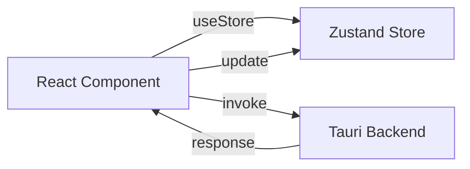

# Frontend Architecture

Il frontend di Kanban AI e costruito con React 18 e gira all'interno di Tauri.

## Stack Tecnologico

```mermaid
graph TB
    subgraph UI["UI Layer"]
        Components[React Components]
        Shadcn[shadcn/ui]
        Tailwind[Tailwind CSS]
    end

    subgraph State["State Layer"]
        Zustand[Zustand Store]
        LocalStorage[Local Storage]
    end

    subgraph Features["Features"]
        DnD[@dnd-kit]
        Motion[Framer Motion]
        CMDK[cmdk]
    end

    subgraph Runtime["Runtime"]
        Tauri[Tauri WebView]
        IPC[IPC Commands]
    end

    Components --> Shadcn
    Shadcn --> Tailwind
    Components --> Zustand
    Zustand --> LocalStorage
    Components --> DnD
    Components --> Motion
    Components --> CMDK
    Components --> IPC
    IPC --> Tauri
```

## Struttura Directory

```
src/
├── components/
│   ├── board/              # Board view components
│   │   ├── Board.tsx       # Main board container
│   │   ├── Column.tsx      # Kanban column
│   │   └── ColumnHeader.tsx
│   │
│   ├── ticket/             # Ticket components
│   │   ├── TicketCard.tsx  # Card in board
│   │   ├── TicketDetail.tsx # Detail modal
│   │   ├── TicketForm.tsx  # Create/edit form
│   │   └── TicketBadges.tsx # Priority, labels, etc.
│   │
│   ├── ai/                 # AI-related components
│   │   ├── AIChat.tsx      # Chat interface
│   │   ├── AISuggestion.tsx # Inline suggestions
│   │   ├── AIStats.tsx     # AI statistics
│   │   └── TriageResult.tsx # Triage display
│   │
│   ├── ui/                 # Base UI (shadcn/ui)
│   │   ├── button.tsx
│   │   ├── dialog.tsx
│   │   ├── input.tsx
│   │   └── ...
│   │
│   ├── layout/             # Layout components
│   │   ├── Sidebar.tsx
│   │   ├── Header.tsx
│   │   └── CommandPalette.tsx
│   │
│   └── shared/             # Shared components
│       ├── Loading.tsx
│       ├── ErrorBoundary.tsx
│       └── EmptyState.tsx
│
├── stores/                 # Zustand stores
│   ├── ticketStore.ts      # Ticket state
│   ├── boardStore.ts       # Board/columns state
│   ├── uiStore.ts          # UI state (modals, etc.)
│   └── aiStore.ts          # AI chat history
│
├── hooks/                  # Custom hooks
│   ├── useTickets.ts       # Ticket operations
│   ├── useBoard.ts         # Board operations
│   ├── useAI.ts            # AI interactions
│   ├── useKeyboard.ts      # Keyboard shortcuts
│   └── useTauri.ts         # Tauri IPC wrapper
│
├── lib/                    # Utilities
│   ├── utils.ts            # General utilities
│   ├── cn.ts               # Class name helper
│   ├── shortcuts.ts        # Keyboard shortcuts config
│   └── api.ts              # API client
│
├── types/                  # TypeScript types
│   ├── ticket.ts           # Ticket types
│   ├── board.ts            # Board types
│   └── api.ts              # API types
│
├── App.tsx                 # Root component
├── main.tsx                # Entry point
└── index.css               # Global styles
```

## State Management

### Zustand Stores

```typescript
// stores/ticketStore.ts
import { create } from 'zustand'
import { persist } from 'zustand/middleware'

interface TicketState {
  tickets: Ticket[]
  selectedId: string | null

  // Actions
  addTicket: (ticket: Ticket) => void
  updateTicket: (id: string, updates: Partial<Ticket>) => void
  deleteTicket: (id: string) => void
  selectTicket: (id: string | null) => void
}

export const useTicketStore = create<TicketState>()(
  persist(
    (set) => ({
      tickets: [],
      selectedId: null,

      addTicket: (ticket) =>
        set((state) => ({ tickets: [...state.tickets, ticket] })),

      updateTicket: (id, updates) =>
        set((state) => ({
          tickets: state.tickets.map((t) =>
            t.id === id ? { ...t, ...updates } : t
          ),
        })),

      deleteTicket: (id) =>
        set((state) => ({
          tickets: state.tickets.filter((t) => t.id !== id),
        })),

      selectTicket: (id) => set({ selectedId: id }),
    }),
    { name: 'ticket-storage' }
  )
)
```

### Store Pattern



## Component Patterns

### Compound Components

```tsx
// components/ticket/TicketCard.tsx
export function TicketCard({ ticket }: { ticket: Ticket }) {
  return (
    <Card className="group">
      <Card.Header>
        <Card.Title>{ticket.title}</Card.Title>
        <Card.Actions>
          <TicketMenu ticket={ticket} />
        </Card.Actions>
      </Card.Header>
      <Card.Content>
        <TicketBadges ticket={ticket} />
      </Card.Content>
    </Card>
  )
}
```

### Controlled vs Uncontrolled

```tsx
// Controlled - stato gestito dal parent
function ControlledInput({ value, onChange }) {
  return <Input value={value} onChange={onChange} />
}

// Uncontrolled - stato interno con ref
function UncontrolledInput({ defaultValue, onSubmit }) {
  const ref = useRef<HTMLInputElement>(null)
  return (
    <form onSubmit={() => onSubmit(ref.current?.value)}>
      <Input ref={ref} defaultValue={defaultValue} />
    </form>
  )
}
```

## Tauri Integration

### IPC Commands

```typescript
// hooks/useTauri.ts
import { invoke } from '@tauri-apps/api/core'

export function useTauri() {
  const createTicket = async (data: CreateTicketData) => {
    return invoke<Ticket>('create_ticket', { data })
  }

  const getTickets = async () => {
    return invoke<Ticket[]>('get_tickets')
  }

  const triageTicket = async (ticketId: string) => {
    return invoke<TriageResult>('triage_ticket', { ticketId })
  }

  return { createTicket, getTickets, triageTicket }
}
```

### Event Listening

```typescript
// hooks/useTicketEvents.ts
import { listen } from '@tauri-apps/api/event'

export function useTicketEvents() {
  useEffect(() => {
    const unlisten = listen<Ticket>('ticket:created', (event) => {
      // Handle new ticket
      addTicket(event.payload)
    })

    return () => { unlisten.then(fn => fn()) }
  }, [])
}
```

## Styling

### Tailwind + shadcn/ui

```tsx
// Design tokens in tailwind.config.js
const config = {
  theme: {
    extend: {
      colors: {
        background: 'hsl(var(--background))',
        foreground: 'hsl(var(--foreground))',
        primary: {
          DEFAULT: 'hsl(var(--primary))',
          foreground: 'hsl(var(--primary-foreground))',
        },
        // ...
      },
    },
  },
}
```

### Class Variance Authority

```tsx
// components/ui/button.tsx
import { cva } from 'class-variance-authority'

const buttonVariants = cva(
  'inline-flex items-center justify-center rounded-md text-sm font-medium',
  {
    variants: {
      variant: {
        default: 'bg-primary text-primary-foreground hover:bg-primary/90',
        destructive: 'bg-destructive text-destructive-foreground',
        outline: 'border border-input bg-background hover:bg-accent',
        ghost: 'hover:bg-accent hover:text-accent-foreground',
      },
      size: {
        default: 'h-10 px-4 py-2',
        sm: 'h-9 px-3',
        lg: 'h-11 px-8',
        icon: 'h-10 w-10',
      },
    },
    defaultVariants: {
      variant: 'default',
      size: 'default',
    },
  }
)
```

## Animations

### Framer Motion

```tsx
// components/ticket/TicketCard.tsx
import { motion } from 'framer-motion'

export function TicketCard({ ticket }) {
  return (
    <motion.div
      layout
      initial={{ opacity: 0, y: 20 }}
      animate={{ opacity: 1, y: 0 }}
      exit={{ opacity: 0, scale: 0.9 }}
      whileHover={{ scale: 1.02 }}
      transition={{ duration: 0.2 }}
    >
      {/* Card content */}
    </motion.div>
  )
}
```

### AnimatePresence

```tsx
// components/board/Board.tsx
import { AnimatePresence } from 'framer-motion'

export function Board({ tickets }) {
  return (
    <AnimatePresence mode="popLayout">
      {tickets.map((ticket) => (
        <TicketCard key={ticket.id} ticket={ticket} />
      ))}
    </AnimatePresence>
  )
}
```

## Drag & Drop

### @dnd-kit Setup

```tsx
// components/board/Board.tsx
import {
  DndContext,
  closestCenter,
  KeyboardSensor,
  PointerSensor,
  useSensor,
  useSensors,
} from '@dnd-kit/core'

export function Board() {
  const sensors = useSensors(
    useSensor(PointerSensor),
    useSensor(KeyboardSensor)
  )

  const handleDragEnd = (event: DragEndEvent) => {
    const { active, over } = event
    if (over && active.id !== over.id) {
      moveTicket(active.id, over.id)
    }
  }

  return (
    <DndContext
      sensors={sensors}
      collisionDetection={closestCenter}
      onDragEnd={handleDragEnd}
    >
      <SortableContext items={ticketIds}>
        {columns.map(col => <Column key={col.id} column={col} />)}
      </SortableContext>
    </DndContext>
  )
}
```

## Command Palette

### cmdk Integration

```tsx
// components/layout/CommandPalette.tsx
import { Command } from 'cmdk'

export function CommandPalette() {
  const [open, setOpen] = useState(false)

  useEffect(() => {
    const down = (e: KeyboardEvent) => {
      if (e.key === 'k' && (e.metaKey || e.ctrlKey)) {
        e.preventDefault()
        setOpen((open) => !open)
      }
    }
    document.addEventListener('keydown', down)
    return () => document.removeEventListener('keydown', down)
  }, [])

  return (
    <Command.Dialog open={open} onOpenChange={setOpen}>
      <Command.Input placeholder="Search or type a command..." />
      <Command.List>
        <Command.Group heading="Actions">
          <Command.Item onSelect={() => createTicket()}>
            Create new ticket
          </Command.Item>
          <Command.Item onSelect={() => openAIChat()}>
            Ask AI
          </Command.Item>
        </Command.Group>
        <Command.Group heading="Recent Tickets">
          {recentTickets.map(ticket => (
            <Command.Item key={ticket.id}>
              {ticket.title}
            </Command.Item>
          ))}
        </Command.Group>
      </Command.List>
    </Command.Dialog>
  )
}
```

## Performance

### React.memo

```tsx
// Previene re-render non necessari
export const TicketCard = memo(function TicketCard({ ticket }) {
  return <div>{ticket.title}</div>
}, (prev, next) => prev.ticket.id === next.ticket.id)
```

### useMemo/useCallback

```tsx
// Memoizza calcoli costosi
const sortedTickets = useMemo(
  () => tickets.sort((a, b) => priorityOrder[b.priority] - priorityOrder[a.priority]),
  [tickets]
)

// Memoizza callback
const handleDragEnd = useCallback((event) => {
  // ...
}, [moveTicket])
```

### Lazy Loading

```tsx
// Carica componenti on-demand
const TicketDetail = lazy(() => import('./TicketDetail'))

function App() {
  return (
    <Suspense fallback={<Loading />}>
      <TicketDetail />
    </Suspense>
  )
}
```
