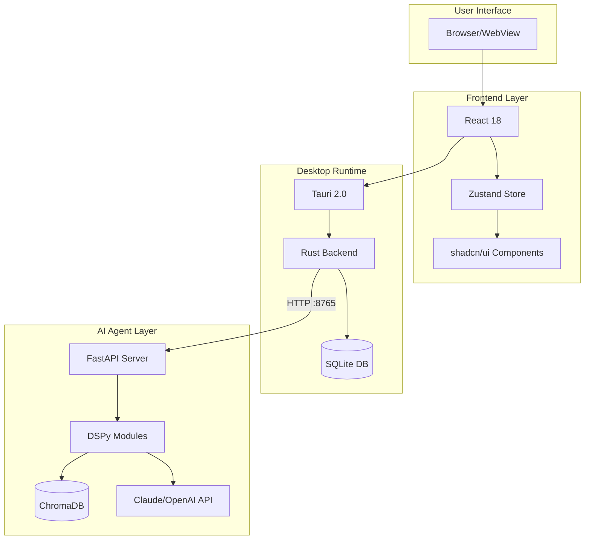
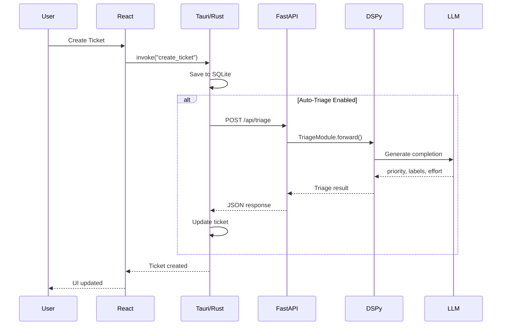

# Architecture Overview

Kanban AI e composta da tre layer principali che comunicano tra loro.

## High-Level Architecture



## Componenti

### Frontend (React + Tauri)

| Componente | Tecnologia | Responsabilita |
|------------|------------|----------------|
| UI Components | React + shadcn/ui | Rendering interfaccia |
| State Management | Zustand | Stato applicativo |
| Styling | Tailwind CSS | Design system |
| Animations | Framer Motion | Micro-interazioni |
| Drag & Drop | @dnd-kit | Spostamento ticket |
| Commands | cmdk | Command palette |

### Desktop Runtime (Tauri)

| Componente | Tecnologia | Responsabilita |
|------------|------------|----------------|
| Runtime | Tauri 2.0 | Webview + native APIs |
| Backend | Rust | Business logic, IPC |
| Database | SQLite | Persistenza dati |
| IPC | Tauri Commands | Frontend ↔ Backend |

### AI Agent (Python)

| Componente | Tecnologia | Responsabilita |
|------------|------------|----------------|
| Server | FastAPI | REST API |
| AI Framework | DSPy | LLM orchestration |
| Vector DB | ChromaDB | Semantic search |
| LLM | Claude/OpenAI | Text generation |

## Communication Flow



## Data Flow

### Ticket Creation

1. **User Input** → React form
2. **Validation** → Frontend validation
3. **IPC Call** → `invoke("create_ticket", data)`
4. **Rust Handler** → Validate, save to SQLite
5. **Auto-Triage** → HTTP call to agent
6. **AI Processing** → DSPy module execution
7. **Response** → Update ticket with AI metadata
8. **UI Update** → React re-render

### Search Query

1. **User Query** → Command palette or chat
2. **IPC Call** → `invoke("search_tickets", query)`
3. **Rust Handler** → Parse query
4. **Dual Search**:
   - SQLite: Full-text search on title/description
   - ChromaDB: Semantic similarity search
5. **Merge Results** → Combine and rank
6. **Response** → Return to frontend
7. **UI Update** → Display results

## Directory Structure

```
kanban/
├── apps/
│   └── desktop/
│       ├── src/                    # React frontend
│       │   ├── components/         # UI components
│       │   │   ├── board/          # Board view
│       │   │   ├── ticket/         # Ticket components
│       │   │   ├── ai/             # AI chat, suggestions
│       │   │   └── ui/             # Base UI (shadcn)
│       │   ├── stores/             # Zustand stores
│       │   ├── hooks/              # Custom React hooks
│       │   ├── lib/                # Utilities
│       │   └── types/              # TypeScript definitions
│       │
│       └── src-tauri/              # Rust backend
│           ├── src/
│           │   ├── main.rs         # Entry point
│           │   ├── commands/       # IPC handlers
│           │   ├── db/             # SQLite operations
│           │   └── models/         # Data models
│           └── Cargo.toml
│
├── services/
│   └── agent/                      # Python AI agent
│       ├── src/
│       │   ├── main.py             # FastAPI app
│       │   ├── config.py           # Settings
│       │   ├── api/                # REST endpoints
│       │   ├── agent/              # DSPy modules
│       │   └── db/                 # ChromaDB setup
│       ├── tests/
│       └── pyproject.toml
│
└── docs/                           # Documentation
```

## Technology Choices

### Why Tauri?

- **Small Binary**: ~10MB vs 100MB+ di Electron
- **Native Performance**: Rust backend, no Node.js runtime
- **Security**: Sandboxed webview, no Node.js vulnerabilities
- **Cross-Platform**: macOS, Windows, Linux

### Why DSPy?

- **Declarative**: Definisci cosa vuoi, non come chiederlo
- **Type-Safe**: Python types per input/output
- **Composable**: Moduli riutilizzabili
- **Optimizable**: Auto-tuning con esempi

### Why ChromaDB?

- **Embedded**: No server separato richiesto
- **Fast**: Ottimizzato per similarity search
- **Simple**: API Python nativa
- **Persistent**: Dati salvati su disco

## Prossimi Passi

- [Frontend Architecture](frontend.md) - Dettagli React/Tauri
- [Backend Architecture](backend.md) - Dettagli Rust
- [Agent Architecture](agent.md) - Dettagli Python/DSPy
- [Data Flow](data-flow.md) - Flussi dati dettagliati
