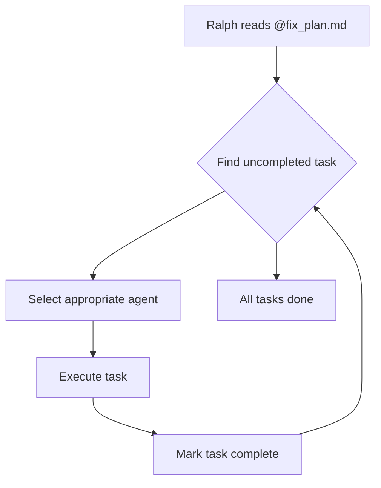

# Ralph - AI Development Assistant

Ralph is the AI-powered development assistant for Kanban AI. It helps automate development tasks, documentation, and code generation.

## Overview

Ralph is a Claude Code-based assistant configured with specialized agents for different tasks. It reads task lists from `@fix_plan.md` and executes them using the appropriate sub-agents.

## How It Works



## Configuration

Ralph is configured through:

1. **CLAUDE.md** - Project context and instructions
2. **@fix_plan.md** - Task list with checkboxes
3. **.claude/** - Specialized agent configurations

### Agent Types

| Agent | Use Case | Tools |
|-------|----------|-------|
| `python-expert` | Python/DSPy code | All |
| `fastapi-expert` | API endpoints | All |
| `react-component-architect` | React components | All |
| `vue-component-architect` | Vue components | All |
| `documentation-specialist` | Documentation | Write, Read, Grep |
| `code-reviewer` | Code review | Read, Grep, Glob |

## Using Ralph

### Starting Ralph

```bash
ralph --reset-session && ralph
```

### Fix Plan Format

Ralph reads tasks from `@fix_plan.md`:

```markdown
# Ralph Fix Plan

## High Priority
- [ ] Task 1 description
- [ ] Task 2 description
- [x] Completed task

## Medium Priority
- [ ] Task 3 description

## Low Priority
- [ ] Task 4 description

## Notes
- Context and instructions for Ralph
```

### Task Format

Tasks should be:
- Clear and actionable
- Single responsibility
- Include file paths when relevant
- Reference patterns to follow

**Good:**
```markdown
- [ ] Create `docs/api-reference/rest-api.md` - All FastAPI endpoints
- [ ] Add DSPy Assertions to TriageModule in `services/agent/src/agent/modules.py`
```

**Avoid:**
```markdown
- [ ] Fix stuff
- [ ] Make it better
```

## Workflow

### 1. Create Fix Plan

Create `@fix_plan.md` with your tasks:

```markdown
# Ralph Fix Plan

## High Priority
- [ ] Implement TriageModule with DSPy Signature
- [ ] Add validation assertions
- [ ] Create API endpoint

## Notes
- Follow existing patterns in modules.py
- Use Pydantic for validation
```

### 2. Start Ralph

```bash
ralph
```

Ralph will:
1. Read the fix plan
2. Find first uncompleted task
3. Use appropriate agent
4. Implement the task
5. Mark as complete `[x]`
6. Move to next task

### 3. Monitor Progress

Watch Ralph's output for:
- Current task being worked on
- Files being modified
- Tests being run
- Completion messages

### 4. Review Changes

After Ralph completes:
```bash
git diff
git status
```

Review changes before committing.

## Agent Selection

Ralph automatically selects agents based on task type:

### DSPy Tasks

For DSPy modules (signatures, assertions, optimization):

```markdown
- [ ] Add DSPy Assertions to TriageModule
```

Ralph uses:
1. `Skill tool` with `skill="scientific-skills:dspy"`
2. `Task tool` with `subagent_type="python-expert"`

### FastAPI Tasks

For API endpoints:

```markdown
- [ ] Create /api/triage endpoint with validation
```

Ralph uses `fastapi-expert` agent.

### Documentation Tasks

For docs:

```markdown
- [ ] Create docs/api-reference/rest-api.md
```

Ralph uses `documentation-specialist` agent.

### React Tasks

For React components:

```markdown
- [ ] Create TicketCard component with drag support
```

Ralph uses `react-component-architect` agent.

## Best Practices

### 1. Small, Focused Tasks

Break large tasks into smaller pieces:

```markdown
## Bad
- [ ] Implement authentication system

## Good
- [ ] Create User model with SQLAlchemy
- [ ] Implement password hashing utility
- [ ] Create login endpoint
- [ ] Create logout endpoint
- [ ] Add JWT token generation
```

### 2. Include Context

Add notes section with relevant information:

```markdown
## Notes
- Use existing patterns in modules.py
- Follow DSPy 2.5 syntax
- Tests should use pytest fixtures
```

### 3. Reference Patterns

Point Ralph to examples:

```markdown
## Notes
- Follow pattern in `services/agent/src/agent/modules.py:TriageModule`
- Use similar structure to `docs/api-reference/rest-api.md`
```

### 4. Prioritize Tasks

Use sections to prioritize:

```markdown
## High Priority (Do First)
- [ ] Critical bug fixes

## Medium Priority
- [ ] Feature implementations

## Low Priority (Do Last)
- [ ] Refactoring
- [ ] Documentation
```

### 5. Checkpoint Progress

For long task lists, add checkpoint tasks:

```markdown
- [ ] Implement feature A
- [ ] Implement feature B
- [ ] CHECKPOINT: Run tests and verify A and B
- [ ] Implement feature C
```

## Troubleshooting

### Ralph Not Finding Tasks

Ensure:
- `@fix_plan.md` exists in project root
- Tasks use `- [ ]` format
- File is readable

### Wrong Agent Being Used

Add explicit instructions:

```markdown
- [ ] [PYTHON] Implement TriageModule
- [ ] [REACT] Create TicketCard component
```

### Task Not Completing

Check:
- Task is too vague (make it specific)
- Dependencies missing (add prerequisite tasks)
- Pattern unclear (reference existing code)

### Errors During Execution

Common issues:
1. **Import errors** - Add missing dependencies
2. **Type errors** - Specify types in task description
3. **Test failures** - Include test requirements

## Example Sessions

### Documentation Session

```markdown
# Ralph Fix Plan

## High Priority
- [x] Create docs/getting-started/installation.md
- [x] Create docs/getting-started/quick-start.md
- [ ] Create docs/api-reference/rest-api.md

## Notes
- Read source files before writing documentation
- Use Mermaid diagrams where appropriate
- Follow existing doc style
```

### Feature Implementation Session

```markdown
# Ralph Fix Plan

## High Priority
- [ ] Add TriageModule to services/agent/src/agent/modules.py
- [ ] Create triage endpoint in api/routes.py
- [ ] Add Pydantic models in api/models.py
- [ ] Write tests in tests/test_triage.py

## Notes
- Use DSPy ChainOfThought pattern
- Follow existing module patterns
- Include input validation
```

### Refactoring Session

```markdown
# Ralph Fix Plan

## Medium Priority
- [ ] Extract common logic from TriageModule to BaseModule
- [ ] Update DecomposeModule to use BaseModule
- [ ] Update ChatModule to use BaseModule
- [ ] Run all tests to verify refactor

## Notes
- Maintain backwards compatibility
- Keep existing interfaces
- Add deprecation warnings if needed
```

## Advanced Usage

### Parallel Tasks

Mark tasks that can run in parallel:

```markdown
## Can Run in Parallel
- [ ] [PARALLEL] Create component A
- [ ] [PARALLEL] Create component B
- [ ] [PARALLEL] Create component C
- [ ] [SEQUENTIAL] Integrate A, B, C
```

### Conditional Tasks

Add conditions for tasks:

```markdown
- [ ] Add feature X (only if feature Y is complete)
- [ ] [IF_NEEDED] Add fallback for feature X
```

### Review Points

Add review checkpoints:

```markdown
- [ ] Implement core feature
- [ ] [REVIEW] Review implementation with team
- [ ] Address review feedback
- [ ] [REVIEW] Final review
```

## Integration with CI/CD

Ralph can be integrated with CI/CD:

```yaml
# .github/workflows/ralph.yml
name: Ralph Tasks

on:
  push:
    paths:
      - '@fix_plan.md'

jobs:
  run-ralph:
    runs-on: ubuntu-latest
    steps:
      - uses: actions/checkout@v4
      - name: Run Ralph
        run: ralph --ci-mode
      - name: Create PR
        if: ${{ success() }}
        run: |
          git checkout -b ralph/auto-tasks
          git add .
          git commit -m "feat: Ralph automated tasks"
          gh pr create
```

## Related Documentation

- [Contributing Guide](contributing.md) - Development workflow
- [Testing Guide](testing.md) - Testing practices
- [DSPy Guide](../dspy-guide/introduction.md) - DSPy patterns
