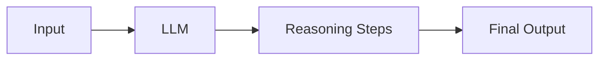
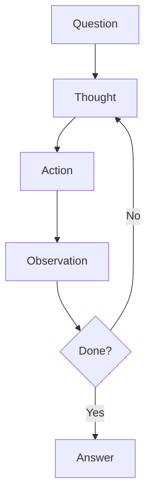

# Core Concepts

Questa pagina approfondisce i concetti fondamentali di DSPy utilizzati in Kanban AI.

## Signatures

Una **Signature** definisce il contratto input/output di un task LLM. E il cuore di DSPy.

### Struttura Base

```python
class MySignature(dspy.Signature):
    """La docstring diventa il system prompt."""

    # Input fields - dati che passi al modulo
    input_field: str = dspy.InputField(desc="Descrizione")

    # Output fields - dati che l'LLM deve generare
    output_field: str = dspy.OutputField(desc="Descrizione")
```

### Tipi Supportati

```python
from typing import Literal, List

class AdvancedSignature(dspy.Signature):
    # Tipi base
    text: str = dspy.InputField()
    count: int = dspy.OutputField()

    # Literal per valori vincolati
    priority: Literal["low", "medium", "high"] = dspy.OutputField()

    # Liste
    tags: list[str] = dspy.OutputField()

    # Dizionari
    metadata: dict = dspy.OutputField()
```

### Best Practices per Signatures

1. **Docstring descrittive**: Diventano le istruzioni del sistema

```python
class GoodSignature(dspy.Signature):
    """Analizza il sentiment di un testo.

    Criteri:
    - positive: esprime soddisfazione, entusiasmo
    - negative: esprime frustrazione, delusione
    - neutral: informativo, senza emozione
    """
```

2. **Field descriptions precise**: Aiutano l'LLM a capire cosa serve

```python
title: str = dspy.InputField(
    desc="Titolo del ticket, max 100 caratteri"
)
```

3. **Usa Literal per valori fissi**: Previene output invalidi

```python
status: Literal["todo", "in_progress", "done"] = dspy.OutputField()
```

## Modules

I **Modules** implementano la logica e sono componibili come funzioni Python.

### Struttura Base

```python
class MyModule(dspy.Module):
    def __init__(self):
        super().__init__()
        # Inizializza i predictors
        self.predictor = dspy.Predict(MySignature)

    def forward(self, **inputs):
        # Logica di esecuzione
        result = self.predictor(**inputs)
        return result
```

### Predictors Disponibili

#### dspy.Predict
Il predictor base, esegue la signature direttamente:

```python
self.predict = dspy.Predict(MySignature)
result = self.predict(input_field="value")
```

#### dspy.ChainOfThought
Aggiunge reasoning step-by-step prima dell'output:

```python
self.cot = dspy.ChainOfThought(MySignature)
result = self.cot(input_field="value")
# result include anche .reasoning
```

#### dspy.ReAct
Per agent che usano tools in un loop reason-act:

```python
self.react = dspy.ReAct(
    signature="question -> answer",
    tools=[search_tool, calculate_tool],
    max_iters=5
)
```

### Composizione di Modules

```python
class PipelineModule(dspy.Module):
    def __init__(self):
        super().__init__()
        self.step1 = FirstModule()
        self.step2 = SecondModule()

    def forward(self, input_data):
        intermediate = self.step1(input_data)
        final = self.step2(intermediate.output)
        return final
```

## ChainOfThought

**ChainOfThought** (CoT) e una tecnica che migliora il ragionamento dell'LLM facendogli esplicitare i passaggi intermedi.

### Come Funziona



Invece di:
```
Input: "2+2*3" -> Output: "8"
```

CoT produce:
```
Input: "2+2*3"
Reasoning: "Prima moltiplico 2*3=6, poi sommo 2+6=8"
Output: "8"
```

### Uso in Kanban AI

```python
class TriageModule(dspy.Module):
    def __init__(self):
        super().__init__()
        # ChainOfThought per ragionamento esplicito
        self.triage = dspy.ChainOfThought(TriageTicket)

    def forward(self, title, description, existing_labels):
        result = self.triage(
            title=title,
            description=description,
            existing_labels=existing_labels
        )
        # result.reasoning contiene il ragionamento
        return result
```

### Quando Usare CoT

| Scenario | Usa CoT? |
|----------|----------|
| Task complessi con piu step | Si |
| Decisioni che richiedono analisi | Si |
| Output semplice e diretto | No |
| Latenza critica | Valuta |

## ReAct Pattern

**ReAct** (Reasoning + Acting) e un pattern per agent che devono usare tools.

### Come Funziona



L'agent:
1. **Pensa** (Thought): Ragiona su cosa fare
2. **Agisce** (Action): Usa un tool
3. **Osserva** (Observation): Legge il risultato
4. **Ripete** finche non ha la risposta

### Implementazione in Kanban AI

```python
from .tools import search_tickets, create_ticket, update_ticket

class KanbanReActAgent(dspy.Module):
    def __init__(self, max_iters: int = 5):
        super().__init__()
        self.react = dspy.ReAct(
            signature="question, board_context -> answer",
            tools=[search_tickets, create_ticket, update_ticket],
            max_iters=max_iters
        )

    def forward(self, question: str) -> dict:
        context = get_board_context()
        result = self.react(
            question=question,
            board_context=str(context)
        )
        return {
            "answer": result.answer,
            "trajectory": getattr(result, "trajectory", [])
        }
```

### Definire Tools

```python
@dspy.tool
def search_tickets(query: str) -> str:
    """Cerca ticket nel board.

    Args:
        query: Termine di ricerca

    Returns:
        Lista di ticket trovati in formato JSON
    """
    results = db.search(query)
    return json.dumps(results)
```

## Prossimi Passi

- [Project Modules](modules.md) - Vedi come questi concetti sono applicati
- [Assertions](assertions.md) - Validazione degli output
- [Examples](examples.md) - Esempi pratici
