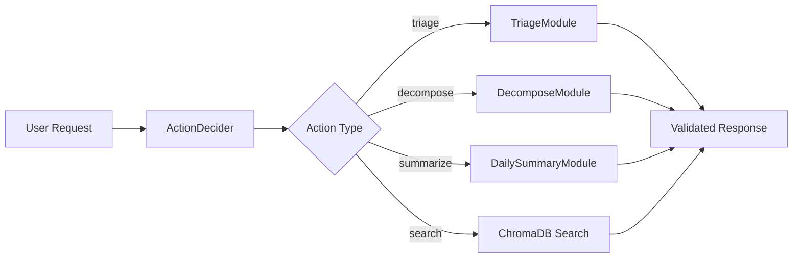

# Introduction to DSPy

DSPy e un framework che rivoluziona il modo di lavorare con i Large Language Models (LLM). Invece di scrivere prompt fragili e difficili da mantenere, DSPy ti permette di definire **cosa** vuoi ottenere, non **come** chiederlo.

## Perche DSPy?

### Il Problema dei Prompt Tradizionali

```python
# Approccio tradizionale - fragile e difficile da mantenere
prompt = f"""
You are an expert ticket triager. Given the following ticket:
Title: {title}
Description: {description}

Please analyze and return:
1. Priority (low/medium/high/critical)
2. Labels (max 3)
3. Effort estimate (xs/s/m/l/xl)

Format your response as JSON...
"""
```

Problemi:
- Prompt hardcoded, difficili da modificare
- Nessun controllo sui tipi di output
- Testing complicato
- Ogni modifica richiede riscrivere tutto

### La Soluzione DSPy

```python
# Approccio DSPy - dichiarativo e type-safe
class TriageTicket(dspy.Signature):
    """Analizza un ticket e assegna metadati appropriati."""

    title: str = dspy.InputField(desc="Ticket title")
    description: str = dspy.InputField(desc="Ticket description")

    priority: Literal["low", "medium", "high", "critical"] = dspy.OutputField()
    labels: list[str] = dspy.OutputField()
    effort: Literal["xs", "s", "m", "l", "xl"] = dspy.OutputField()
```

Vantaggi:
- **Dichiarativo**: Definisci input/output, DSPy genera il prompt
- **Type-safe**: Python types per validazione automatica
- **Componibile**: Moduli riutilizzabili come funzioni
- **Ottimizzabile**: Auto-tuning con esempi

## Concetti Chiave

### 1. Signatures

Le Signatures definiscono il contratto di un task LLM:

```python
class MySignature(dspy.Signature):
    """Docstring diventa le istruzioni del sistema."""

    input_field: str = dspy.InputField(desc="Descrizione dell'input")
    output_field: str = dspy.OutputField(desc="Descrizione dell'output")
```

### 2. Modules

I Modules implementano la logica e possono essere composti:

```python
class MyModule(dspy.Module):
    def __init__(self):
        self.predictor = dspy.ChainOfThought(MySignature)

    def forward(self, input_field: str):
        return self.predictor(input_field=input_field)
```

### 3. Assertions

Le Assertions validano l'output e possono far riprovare l'LLM:

```python
result = self.predictor(...)

# Hard constraint - riprova se fallisce
dspy.Assert(
    result.priority in VALID_PRIORITIES,
    f"Priority invalida: {result.priority}"
)

# Soft constraint - log warning ma continua
dspy.Suggest(
    len(result.labels) <= 3,
    "Troppe labels, preferire max 3"
)
```

## Come Funziona in Kanban AI



L'agent decide quale modulo usare basandosi sul messaggio dell'utente, esegue il modulo appropriato, valida l'output con assertions, e restituisce il risultato.

## Prossimi Passi

- [Core Concepts](concepts.md) - Approfondimento su Signatures, Modules, ChainOfThought
- [Project Modules](modules.md) - Documentazione dei moduli di Kanban AI
- [Assertions](assertions.md) - Come validare l'output
- [Optimization](optimization.md) - Come ottimizzare i moduli
