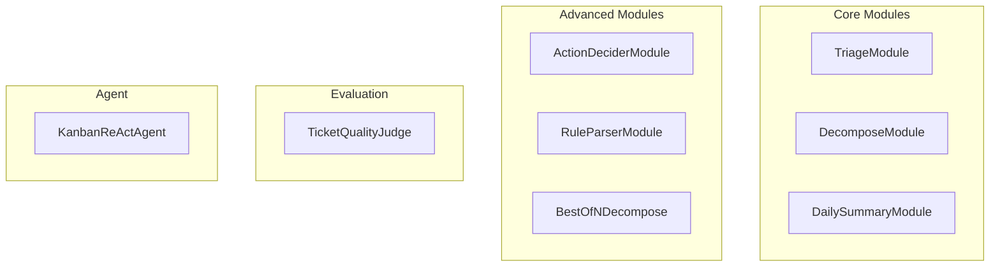
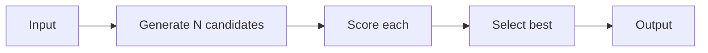

# Project Modules

Questa pagina documenta tutti i moduli DSPy implementati in Kanban AI.

## Overview



## TriageModule

Assegna automaticamente priority, labels ed effort estimate a nuovi ticket.

### Signature

```python
class TriageTicket(dspy.Signature):
    """Analyze a ticket and assign appropriate metadata.

    Priority criteria:
    - critical: Blocks production/users, requires immediate fix
    - high: Important, significant impact, within 1-2 days
    - medium: Standard, can be planned normally
    - low: Nice-to-have, can wait

    Effort criteria:
    - xs: < 1 hour, quick fix
    - s: 1-4 hours, half day
    - m: 1-2 days, standard task
    - l: 3-5 days, complex feature
    - xl: > 1 week, epic
    """

    title: str = dspy.InputField(desc="Ticket title")
    description: str = dspy.InputField(desc="Ticket description")
    existing_labels: list[str] = dspy.InputField(
        desc="Labels already used in the board for consistency"
    )

    priority: Literal["low", "medium", "high", "critical"] = dspy.OutputField()
    labels: list[str] = dspy.OutputField(desc="List of max 3 relevant labels")
    effort_estimate: Literal["xs", "s", "m", "l", "xl"] = dspy.OutputField()
    reasoning: str = dspy.OutputField(desc="Brief explanation of choices")
```

### Uso

```python
from agent.modules import TriageModule

triage = TriageModule()
result = triage(
    title="Fix login bug on Safari",
    description="Users report they cannot login using Safari browser",
    existing_labels=["bug", "auth", "frontend", "browser"]
)

print(result.priority)        # "high"
print(result.labels)          # ["bug", "auth", "browser"]
print(result.effort_estimate) # "s"
print(result.reasoning)       # "Login issues are critical..."
```

### Assertions

| Tipo | Constraint | Messaggio |
|------|------------|-----------|
| Assert | `priority in VALID_PRIORITIES` | Priority must be valid |
| Assert | `effort in VALID_EFFORTS` | Effort must be valid |
| Assert | `isinstance(labels, list)` | Labels must be a list |
| Suggest | `len(labels) <= 3` | Prefer max 3 labels |
| Suggest | `len(reasoning) >= 20` | Reasoning should be detailed |

---

## DecomposeModule

Scompone task complessi in subtask atomici e gestibili.

### Signature

```python
class DecomposeTask(dspy.Signature):
    """Decompose a task into atomic, actionable subtasks.

    Each subtask should be:
    - Completable in a single work session
    - Verifiable (clear done criteria)
    - As independent as possible

    Output 3-7 subtasks for typical tasks.
    """

    title: str = dspy.InputField(desc="Task title")
    description: str = dspy.InputField(desc="Detailed task description")
    context: str = dspy.InputField(desc="Board context")

    subtasks: list[dict] = dspy.OutputField(
        desc="List of subtasks with {title, description, effort}"
    )
    dependencies: list[tuple[int, int]] = dspy.OutputField(
        desc="List of dependency pairs (subtask_index, depends_on_index)"
    )
    reasoning: str = dspy.OutputField(desc="Decomposition strategy explanation")
```

### Uso

```python
from agent.modules import DecomposeModule

decompose = DecomposeModule()
result = decompose(
    title="Implement user authentication",
    description="Add login/logout functionality with JWT tokens",
    context="React frontend, FastAPI backend, PostgreSQL database"
)

for subtask in result.subtasks:
    print(f"- {subtask['title']} ({subtask['effort']})")
    print(f"  {subtask['description']}")

# Output:
# - Setup JWT configuration (xs)
#   Configure JWT secret and token expiration settings
# - Create user model (s)
#   Define User SQLAlchemy model with password hashing
# - Implement login endpoint (s)
#   POST /auth/login with email/password validation
# ...
```

### Assertions

| Tipo | Constraint | Messaggio |
|------|------------|-----------|
| Assert | `isinstance(subtasks, list)` | Subtasks must be a list |
| Assert | `len(subtasks) >= 2` | At least 2 subtasks |
| Assert | `len(subtasks) <= 10` | Maximum 10 subtasks |
| Assert | `subtask has 'title'` | Each subtask needs title |
| Suggest | `3 <= len(subtasks) <= 7` | Optimal range is 3-7 |

---

## BestOfNDecompose

Variante che genera N decomposizioni e seleziona la migliore.

### Come Funziona



### Scoring Function

```python
def score_decomposition(subtasks: list[dict]) -> float:
    score = 0.0

    for task in subtasks:
        # +2 for having both title and description
        if task.get("title") and task.get("description"):
            score += 2.0

        # +1 for valid effort estimate
        if task.get("effort") in VALID_EFFORTS:
            score += 1.0

        # -1 for vague titles
        if len(task.get("title", "")) < 10:
            score -= 1.0

    # -2 for too many subtasks
    if len(subtasks) > 7:
        score -= 2.0

    # Bonus for optimal range (3-5 subtasks)
    if 3 <= len(subtasks) <= 5:
        score += 1.0

    return score
```

### Uso

```python
from agent.modules import BestOfNDecompose

decompose = BestOfNDecompose(n_candidates=3)
result = decompose(
    title="Build REST API",
    description="Create CRUD endpoints for products"
)

print(f"Score: {result['score']}")
print(f"Candidates evaluated: {result['candidates_evaluated']}")
```

---

## DailySummaryModule

Genera un riepilogo giornaliero personalizzato con priorita.

### Signature

```python
class DailySummary(dspy.Signature):
    """Generate a personalized daily summary with priorities."""

    in_progress: list[dict] = dspy.InputField(desc="Tickets in progress")
    blocked: list[dict] = dspy.InputField(desc="Blocked tickets")
    due_soon: list[dict] = dspy.InputField(desc="Tickets with approaching deadlines")
    recently_completed: list[dict] = dspy.InputField(desc="Recently completed")

    greeting: str = dspy.OutputField(desc="Personalized greeting")
    focus_today: list[str] = dspy.OutputField(desc="Top 3 priorities")
    blockers: list[str] = dspy.OutputField(desc="Blockers needing attention")
    quick_wins: list[str] = dspy.OutputField(desc="Quick wins for today")
```

### Uso

```python
from agent.modules import DailySummaryModule

summary = DailySummaryModule()
result = summary(
    in_progress=[{"title": "Fix login bug", "priority": "high"}],
    blocked=[{"title": "API integration", "blocker": "Waiting for docs"}],
    due_soon=[{"title": "Release v2.0", "due_date": "2024-01-15"}],
    recently_completed=[{"title": "Add dark mode"}]
)

print(result.greeting)
# "Buongiorno! Hai 1 task in progress e 1 bloccato."

print(result.focus_today)
# ["Fix login bug (high priority)", "Sbloccare API integration", "Prepare for v2.0 release"]
```

---

## ActionDeciderModule

Decide quale azione eseguire basandosi sul messaggio dell'utente.

### Actions Disponibili

| Action | Descrizione | Parametri Richiesti |
|--------|-------------|---------------------|
| `create` | Crea nuovo ticket | `title` |
| `update` | Modifica ticket | `ticket_id`, fields |
| `move` | Sposta ticket | `ticket_id` o `column` |
| `search` | Cerca ticket | `query` |
| `summarize` | Genera summary | - |
| `decompose` | Scomponi task | `ticket_id` |
| `none` | Solo risposta | - |

### Uso

```python
from agent.modules import ActionDeciderModule

decider = ActionDeciderModule()
result = decider(
    user_message="Crea un ticket per aggiungere dark mode",
    current_context={"tickets": [...], "current_view": "board"}
)

print(result.action)   # "create"
print(result.params)   # {"title": "Add dark mode", "labels": ["feature", "ui"]}
print(result.response) # "Ho creato il ticket 'Add dark mode'..."
```

---

## RuleParserModule

Converte regole di automazione in linguaggio naturale in formato strutturato.

### Trigger Types

| Trigger | Descrizione |
|---------|-------------|
| `ticket_created` | Nuovo ticket creato |
| `ticket_moved` | Ticket spostato |
| `ticket_updated` | Ticket modificato |
| `label_added` | Label aggiunta |
| `label_removed` | Label rimossa |
| `due_date_approaching` | Deadline vicina |
| `priority_changed` | Priority cambiata |

### Action Types

| Action | Descrizione |
|--------|-------------|
| `move_ticket` | Sposta ticket |
| `set_priority` | Imposta priority |
| `add_label` | Aggiungi label |
| `remove_label` | Rimuovi label |
| `set_due_date` | Imposta deadline |
| `notify` | Invia notifica |
| `auto_triage` | Esegui triage AI |

### Uso

```python
from agent.modules import RuleParserModule

parser = RuleParserModule()
result = parser(
    natural_language="When a ticket is moved to Done, add the 'completed' label",
    board_context={"columns": ["Todo", "In Progress", "Done"]}
)

print(result.rule_name)      # "Add completed on done"
print(result.trigger_type)   # "ticket_moved"
print(result.trigger_config) # {"column_name": "Done"}
print(result.action_type)    # "add_label"
print(result.action_config)  # {"label_name": "completed"}
print(result.confidence)     # 0.95
```

---

## TicketQualityJudge

Valuta la qualita di un ticket usando il pattern LLM-as-Judge.

### Dimensioni Valutate

| Dimensione | Descrizione | Range |
|------------|-------------|-------|
| Clarity | Quanto e chiaro e comprensibile | 0-10 |
| Completeness | Ha tutte le info necessarie | 0-10 |
| Actionability | Si puo agire immediatamente | 0-10 |

### Uso

```python
from agent.judge import TicketQualityJudge

judge = TicketQualityJudge()
result = judge.evaluate_ticket({
    "title": "Fix bug",
    "description": "There's a bug",
    "priority": "high",
    "effort": "m",
    "labels": ["bug"]
})

print(result["clarity_score"])       # 3
print(result["completeness_score"])  # 2
print(result["actionability_score"]) # 2
print(result["overall_score"])       # 2.33
print(result["feedback"])
# "Il ticket manca di dettagli cruciali:
#  - Quale bug? Dove si manifesta?
#  - Steps to reproduce?
#  - Expected vs actual behavior?"
```

---

## KanbanReActAgent

Agent che usa il pattern ReAct per ragionare e usare tools.

### Tools Disponibili

```python
@dspy.tool
def search_tickets(query: str) -> str:
    """Cerca ticket nel board."""

@dspy.tool
def create_ticket(title: str, description: str) -> str:
    """Crea un nuovo ticket."""

@dspy.tool
def update_ticket(ticket_id: str, updates: dict) -> str:
    """Aggiorna un ticket esistente."""

@dspy.tool
def web_search(query: str) -> str:
    """Cerca informazioni sul web."""
```

### Uso

```python
from agent.react_agent import KanbanReActAgent

agent = KanbanReActAgent(max_iters=5)
result = agent(
    question="Trova tutti i bug critici e suggerisci quali fare prima"
)

print(result["answer"])
# "Ho trovato 3 bug critici. Ti consiglio di iniziare con..."

print(result["trajectory"])
# [
#   {"thought": "Devo cercare i bug critici", "action": "search_tickets", ...},
#   {"thought": "Ora analizzo i risultati", ...},
#   ...
# ]
```

## File Location

Tutti i moduli si trovano in:

```
services/agent/src/agent/
├── modules.py      # TriageModule, DecomposeModule, DailySummaryModule, etc.
├── react_agent.py  # KanbanReActAgent
├── judge.py        # TicketQualityJudge
├── tools.py        # Tool definitions for ReAct
└── __init__.py     # Exports
```
