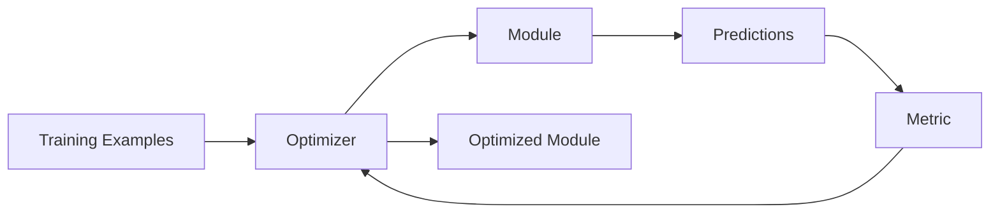

# Optimization

DSPy supporta l'ottimizzazione automatica dei moduli usando esempi. Questo permette di migliorare le performance senza modificare manualmente i prompt.

## Concetti Base

### Come Funziona



1. Fornisci esempi di input/output attesi
2. L'optimizer esegue il modulo sugli esempi
3. Una metrica valuta la qualita delle predizioni
4. L'optimizer aggiusta il modulo (few-shot examples, prompt tuning)
5. Ripete finche la metrica non migliora

### Optimizers Disponibili

| Optimizer | Descrizione | Quando Usare |
|-----------|-------------|--------------|
| `BootstrapFewShot` | Seleziona esempi ottimali | Default, buon punto di partenza |
| `BootstrapFewShotWithRandomSearch` | + ricerca random | Piu tempo, risultati migliori |
| `MIPRO` | Multi-prompt optimization | Massima qualita |
| `BootstrapFinetune` | Fine-tuning del modello | Modelli open-source |

## Definire una Metrica

La metrica valuta quanto e buona una predizione rispetto all'atteso.

### Metrica Semplice

```python
def triage_metric(example, prediction) -> float:
    """Valuta la qualita del triage.

    Args:
        example: Esempio con expected output
        prediction: Output del modulo

    Returns:
        Score da 0.0 a 1.0
    """
    score = 0.0

    # Priority match
    if prediction.priority == example.expected_priority:
        score += 0.4

    # Labels overlap
    expected_labels = set(example.expected_labels)
    predicted_labels = set(prediction.labels)
    if expected_labels:
        label_overlap = len(expected_labels & predicted_labels) / len(expected_labels)
        score += 0.3 * label_overlap

    # Effort match
    if prediction.effort_estimate == example.expected_effort:
        score += 0.3

    return score
```

### Metrica con Grading

```python
def quality_metric(example, prediction) -> float:
    """Metrica piu sofisticata con grading."""

    # Priority: exact match = 1.0, adjacent = 0.5, else = 0
    priority_order = ["low", "medium", "high", "critical"]

    if prediction.priority == example.expected_priority:
        priority_score = 1.0
    else:
        pred_idx = priority_order.index(prediction.priority)
        exp_idx = priority_order.index(example.expected_priority)
        if abs(pred_idx - exp_idx) == 1:
            priority_score = 0.5
        else:
            priority_score = 0.0

    # Labels: Jaccard similarity
    pred_set = set(prediction.labels)
    exp_set = set(example.expected_labels)
    if pred_set or exp_set:
        jaccard = len(pred_set & exp_set) / len(pred_set | exp_set)
    else:
        jaccard = 1.0

    return (priority_score + jaccard) / 2
```

## Creare Training Examples

### Formato Base

```python
import dspy

# Crea esempi con input e output attesi
examples = [
    dspy.Example(
        title="URGENT: Production server down",
        description="Main API server not responding since 10am",
        existing_labels=["bug", "infra", "urgent"],
        expected_priority="critical",
        expected_labels=["bug", "infra", "urgent"],
        expected_effort="xs"
    ).with_inputs("title", "description", "existing_labels"),

    dspy.Example(
        title="Add dark mode toggle",
        description="Users want a dark mode option in settings",
        existing_labels=["feature", "ui", "settings"],
        expected_priority="low",
        expected_labels=["feature", "ui"],
        expected_effort="m"
    ).with_inputs("title", "description", "existing_labels"),

    # ... altri esempi
]
```

### Da Dati Esistenti

```python
def load_examples_from_db():
    """Carica esempi dal database di ticket triaged."""
    tickets = db.query("""
        SELECT title, description, priority, labels, effort
        FROM tickets
        WHERE manually_triaged = true
        LIMIT 100
    """)

    examples = []
    for t in tickets:
        examples.append(dspy.Example(
            title=t.title,
            description=t.description,
            existing_labels=get_board_labels(),
            expected_priority=t.priority,
            expected_labels=t.labels,
            expected_effort=t.effort
        ).with_inputs("title", "description", "existing_labels"))

    return examples
```

## Eseguire l'Ottimizzazione

### BootstrapFewShot

```python
from dspy.teleprompt import BootstrapFewShot
from agent.modules import TriageModule

# Prepara
module = TriageModule()
train_examples = load_examples()[:80]  # 80% training
test_examples = load_examples()[80:]    # 20% test

# Ottimizza
optimizer = BootstrapFewShot(
    metric=triage_metric,
    max_bootstrapped_demos=4,  # Numero di esempi da includere
    max_labeled_demos=16,      # Pool di esempi da cui scegliere
)

optimized_module = optimizer.compile(
    module,
    trainset=train_examples
)
```

### BootstrapFewShotWithRandomSearch

```python
from dspy.teleprompt import BootstrapFewShotWithRandomSearch

optimizer = BootstrapFewShotWithRandomSearch(
    metric=triage_metric,
    max_bootstrapped_demos=4,
    max_labeled_demos=16,
    num_candidate_programs=10,  # Quante varianti provare
    num_threads=4               # Parallelismo
)

optimized_module = optimizer.compile(
    module,
    trainset=train_examples
)
```

## Salvare e Caricare Moduli Ottimizzati

### Salvare

```python
# Salva il modulo ottimizzato
optimized_module.save("models/triage_optimized.json")
```

### Caricare

```python
# Carica in produzione
module = TriageModule()
module.load("models/triage_optimized.json")
```

## Valutare i Risultati

### Evaluation Loop

```python
def evaluate_module(module, test_examples, metric):
    """Valuta un modulo su test examples."""
    scores = []

    for example in test_examples:
        # Esegui predizione
        prediction = module(
            title=example.title,
            description=example.description,
            existing_labels=example.existing_labels
        )

        # Calcola score
        score = metric(example, prediction)
        scores.append(score)

    return {
        "mean_score": sum(scores) / len(scores),
        "min_score": min(scores),
        "max_score": max(scores),
        "scores": scores
    }

# Prima dell'ottimizzazione
baseline_results = evaluate_module(
    TriageModule(),
    test_examples,
    triage_metric
)
print(f"Baseline: {baseline_results['mean_score']:.2%}")

# Dopo l'ottimizzazione
optimized_results = evaluate_module(
    optimized_module,
    test_examples,
    triage_metric
)
print(f"Optimized: {optimized_results['mean_score']:.2%}")
```

### Output Tipico

```
Baseline: 72.5%
Optimized: 89.3%
Improvement: +16.8%
```

## Best Practices

### 1. Esempi Diversificati

```python
# Buono: esempi che coprono casi diversi
examples = [
    # Bug critico
    Example(title="URGENT: Server down", expected_priority="critical"),
    # Feature semplice
    Example(title="Add tooltip", expected_priority="low"),
    # Task medio
    Example(title="Refactor auth module", expected_priority="medium"),
    # ...
]

# Cattivo: tutti esempi simili
examples = [
    Example(title="Fix bug 1", expected_priority="high"),
    Example(title="Fix bug 2", expected_priority="high"),
    Example(title="Fix bug 3", expected_priority="high"),
]
```

### 2. Metriche Bilanciate

```python
def balanced_metric(example, prediction):
    """Bilancia diversi aspetti."""
    return (
        0.4 * priority_match(example, prediction) +
        0.3 * labels_overlap(example, prediction) +
        0.2 * effort_match(example, prediction) +
        0.1 * reasoning_quality(example, prediction)
    )
```

### 3. Validazione Separata

```python
# Split 70/15/15
train = examples[:70]
val = examples[70:85]
test = examples[85:]

# Ottimizza su train
optimized = optimizer.compile(module, trainset=train)

# Valida su val (per hyperparameter tuning)
val_score = evaluate(optimized, val)

# Test finale su test (una volta sola)
test_score = evaluate(optimized, test)
```

### 4. Versioning

```python
import json
from datetime import datetime

def save_with_metadata(module, path, metric_results):
    """Salva modulo con metadata."""
    module.save(path)

    metadata = {
        "saved_at": datetime.now().isoformat(),
        "metric_results": metric_results,
        "dspy_version": dspy.__version__,
    }

    with open(f"{path}.meta.json", "w") as f:
        json.dump(metadata, f, indent=2)
```

## Workflow Completo

```python
#!/usr/bin/env python
"""Script per ottimizzare il modulo di triage."""

import dspy
from dspy.teleprompt import BootstrapFewShot
from agent.modules import TriageModule

def main():
    # 1. Setup
    dspy.configure(lm=dspy.LM("anthropic/claude-sonnet-4-20250514"))

    # 2. Carica esempi
    examples = load_examples_from_db()
    train, test = examples[:80], examples[80:]

    # 3. Crea modulo
    module = TriageModule()

    # 4. Valuta baseline
    baseline = evaluate_module(module, test, triage_metric)
    print(f"Baseline: {baseline['mean_score']:.2%}")

    # 5. Ottimizza
    optimizer = BootstrapFewShot(
        metric=triage_metric,
        max_bootstrapped_demos=4
    )
    optimized = optimizer.compile(module, trainset=train)

    # 6. Valuta ottimizzato
    results = evaluate_module(optimized, test, triage_metric)
    print(f"Optimized: {results['mean_score']:.2%}")

    # 7. Salva se migliore
    if results['mean_score'] > baseline['mean_score']:
        save_with_metadata(optimized, "models/triage_v2.json", results)
        print("Saved new optimized model!")

if __name__ == "__main__":
    main()
```
