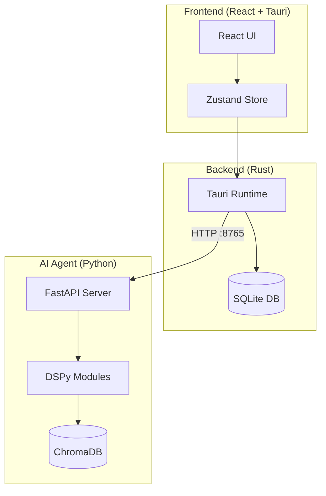

# Kanban AI

**Desktop app per la gestione di ticket in locale con AI agent integrato**

Kanban AI combina un'interfaccia moderna stile [Linear](https://linear.app) con funzionalità AI avanzate basate su [DSPy](https://dspy.ai) per la gestione automatica dei ticket.

## Caratteristiche Principali

- **Interfaccia Moderna** - Dark mode, glassmorphism, animazioni fluide a 60fps
- **AI Agent Integrato** - Triage automatico, decomposizione task, ricerca semantica
- **100% Locale** - I tuoi dati restano sul tuo computer
- **Cross-Platform** - Funziona su macOS, Windows e Linux

## Quick Start

```bash
# Clona il repository
git clone https://github.com/kanban-ai/kanban.git
cd kanban

# Installa le dipendenze frontend
cd apps/desktop && pnpm install

# Avvia l'app in development
pnpm tauri dev

# In un altro terminale, avvia l'agent AI
cd services/agent && uv run fastapi dev
```

## Architettura



## Funzionalita AI

| Funzione | Descrizione |
|----------|-------------|
| **Auto-triage** | Assegna automaticamente priority, labels, effort estimate |
| **Smart decompose** | Scompone task complessi in subtask gestibili |
| **Daily summary** | Genera standup summary con focus del giorno |
| **Semantic search** | Trova ticket correlati via embeddings |
| **Auto-actions** | Crea e modifica ticket autonomamente |

## Tech Stack

=== "Frontend"
    - React 18 + TypeScript
    - Vite (build tool)
    - Tailwind CSS + shadcn/ui
    - Zustand (state management)
    - Framer Motion (animations)
    - @dnd-kit (drag & drop)

=== "Backend"
    - Tauri 2.0 (Rust)
    - SQLite (rusqlite)
    - File system locale

=== "AI Agent"
    - FastAPI (Python)
    - DSPy (LLM framework)
    - ChromaDB (vector store)
    - Claude/OpenAI (LLM)

## Keyboard Shortcuts

| Shortcut | Azione |
|----------|--------|
| `Cmd+K` | Apri command palette |
| `Cmd+N` | Nuovo ticket |
| `Cmd+Shift+A` | Chiedi all'AI |
| `Cmd+/` | Toggle sidebar |
| `Cmd+1-4` | Cambia vista |

## Prossimi Passi

| Sezione | Descrizione |
|---------|-------------|
| [**Installation**](getting-started/installation.md) | Guida completa all'installazione su tutti i sistemi operativi |
| [**DSPy Guide**](dspy-guide/introduction.md) | Impara come funziona l'AI agent e come personalizzarlo |
| [**API Reference**](api-reference/rest-api.md) | Documentazione completa delle API REST e Tauri |
| [**Contributing**](development/contributing.md) | Come contribuire al progetto |
