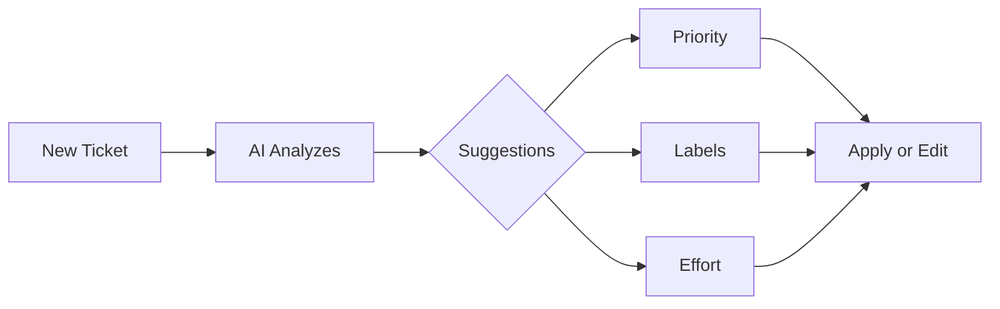
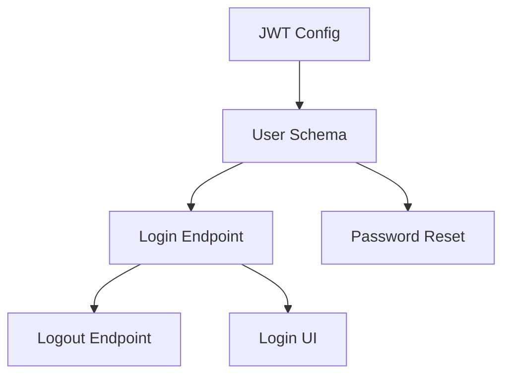
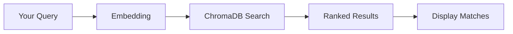

# AI Features Guide

Kanban AI integrates intelligent features powered by DSPy and LLMs to automate and enhance your workflow.

## Overview

The AI agent provides several capabilities:

| Feature | Description | Shortcut |
|---------|-------------|----------|
| Auto-Triage | Automatic priority, labels, effort | On create |
| Smart Decompose | Break tasks into subtasks | `Cmd+D` |
| Daily Summary | Personalized standup | `Cmd+Shift+S` |
| Chat Assistant | Natural language commands | `Cmd+Shift+A` |
| Semantic Search | Find related tickets | `Cmd+F` |
| Quality Judge | Evaluate ticket quality | In detail panel |
| Proactive Suggestions | Board improvement tips | Automatic |

---

## Auto-Triage

When you create a new ticket, the AI automatically analyzes it and suggests:

- **Priority**: Low, Medium, High, or Critical
- **Labels**: Up to 3 relevant tags
- **Effort**: T-shirt size estimate (XS-XL)

### How It Works



### Using Auto-Triage

1. Create a ticket with title and description
2. AI suggestions appear automatically
3. Click **Apply** to accept or **Edit** to modify
4. Suggestions are non-destructive - edit anytime

### Configuration

Toggle auto-triage in Settings:
- **Enable/Disable**: Turn AI triage on/off
- **Auto-apply**: Apply suggestions automatically (or prompt first)
- **Label Source**: Use existing labels or create new ones

!!! tip "Better Triage Results"
    Provide detailed descriptions for more accurate suggestions. Include:

    - What the issue is or feature does
    - Why it's needed
    - Any constraints or requirements

---

## Smart Decompose

Break down complex tasks into manageable subtasks.

### Using Decompose

1. Open a ticket detail panel
2. Click **Decompose** or press `Cmd+D`
3. AI generates subtask suggestions
4. Review and edit as needed
5. Click **Create Subtasks** to apply

### Example

**Original Ticket:** "Implement user authentication"

**AI-Generated Subtasks:**

| Subtask | Effort | Dependency |
|---------|--------|------------|
| Set up JWT configuration | XS | - |
| Create user database schema | S | 1 |
| Implement login endpoint | S | 2 |
| Implement logout endpoint | XS | 3 |
| Add password reset flow | M | 2 |
| Create login UI component | M | 3 |

### Dependency Visualization



### Configuration

- **Max Subtasks**: Limit generated subtasks (default: 7)
- **Include Dependencies**: Show task relationships
- **Auto-Estimate Effort**: AI estimates each subtask

---

## Daily Summary

Get a personalized standup summary each day.

### Accessing Daily Summary

- Press `Cmd+Shift+S` from anywhere
- Click the sun icon in the header
- Open automatically on first launch (configurable)

### What's Included

1. **Personalized Greeting**: Context-aware welcome
2. **Focus Today**: Top 3 priorities to tackle
3. **Blockers**: Identified obstacles
4. **Quick Wins**: Easy tasks to complete

### Example Summary

```
Good morning! Here's your focus for today.

Priority Focus:
1. Complete the login API endpoint (high priority, due today)
2. Review pending pull requests (2 awaiting review)
3. Fix the navbar alignment bug (blocks mobile release)

Blockers:
- Waiting for design specs for dashboard redesign

Quick Wins:
- Update README with new setup steps
- Close "Fix typo" tickets (3 ready to merge)
```

### Customization

Configure in Settings:
- **Show on Startup**: Display summary when app opens
- **Summary Time**: Set preferred time for refresh
- **Include Completed**: Show yesterday's completions

---

## Chat Assistant

Interact with the AI using natural language.

### Opening Chat

- Press `Cmd+Shift+A` (Ask AI)
- Click the chat icon in the sidebar
- Type `/ask` in command palette

### Supported Commands

| Say | Action |
|-----|--------|
| "Create a ticket for..." | Creates a new ticket |
| "Move X to Done" | Moves ticket to column |
| "What's blocking me?" | Lists blockers |
| "Summarize my day" | Generates summary |
| "Find tickets about auth" | Semantic search |
| "Decompose the auth ticket" | Breaks down task |
| "Set priority to high" | Updates ticket |

### Example Conversations

**Creating a Ticket:**
```
You: Create a ticket for adding dark mode to the settings page

AI: I'll create that ticket for you.

    Title: Add dark mode to settings page
    Priority: Medium
    Labels: feature, ui

    Created! Would you like me to add more details?
```

**Finding Information:**
```
You: What tickets are blocking the release?

AI: I found 2 tickets that may be blocking the release:

    1. "Fix critical login bug" (Critical, In Progress)
    2. "Update deployment scripts" (High, Review)

    Would you like to focus on one of these?
```

### Chat Context

The AI has access to:
- Current board state
- Your ticket history
- Recent activity
- Board settings

It does NOT have access to:
- External systems
- Your code
- Private information

---

## Semantic Search

Find tickets using natural language queries, not just keywords.

### Using Semantic Search

1. Press `Cmd+F` to open search
2. Type your query naturally
3. Results ranked by relevance

### Examples

| Query | Finds |
|-------|-------|
| "authentication problems" | Tickets about login, auth, password issues |
| "slow performance" | Tickets about speed, optimization, lag |
| "UI improvements" | Tickets about design, UX, styling |

### How It Works



The search uses embeddings to find semantically similar tickets, even if they don't contain the exact words you searched for.

### Advanced Search

Combine semantic search with filters:
```
authentication problems priority:high label:bug
```

---

## Quality Judge

Evaluate ticket quality to improve clarity and actionability.

### Using Quality Judge

1. Open a ticket detail panel
2. Click **Judge Quality** or the checkmark icon
3. View quality scores and feedback

### Quality Metrics

| Metric | Description | Score |
|--------|-------------|-------|
| Clarity | Is the ticket easy to understand? | 0-10 |
| Completeness | Does it have all needed information? | 0-10 |
| Actionability | Can someone start working on it? | 0-10 |

### Example Feedback

```
Overall Score: 7.0/10

Clarity: 8/10
  Good: Clear problem statement

Completeness: 6/10
  Missing: Acceptance criteria, steps to reproduce

Actionability: 7/10
  Good: Clear scope
  Missing: Definition of done

Suggestions:
- Add acceptance criteria to clarify expected outcome
- Include steps to reproduce for the bug
- Define what "done" looks like
```

### Improving Ticket Quality

Based on feedback, add:
- **Acceptance Criteria**: What defines success
- **Steps to Reproduce**: For bugs
- **Context**: Why this matters
- **Constraints**: Technical or time limitations

---

## Proactive Suggestions

The AI monitors your board and provides improvement suggestions.

### Types of Suggestions

| Type | Example |
|------|---------|
| Stale Tickets | "Ticket X hasn't been updated in 14 days" |
| WIP Limits | "In Progress has 8 items - consider focusing" |
| Priority Balance | "5 critical tickets - consider triaging" |
| Duplicate Detection | "Ticket X may be duplicate of Y" |

### Viewing Suggestions

- Check the notification bell icon
- Suggestions appear in the sidebar
- Review daily during standup

### Acting on Suggestions

Each suggestion includes:
- **Description**: What was detected
- **Recommendation**: Suggested action
- **Quick Action**: One-click resolution

### Configuration

In Settings > AI > Suggestions:
- **Enable Suggestions**: Toggle on/off
- **Suggestion Types**: Select which to show
- **Notification Frequency**: Real-time or daily digest

---

## Multi-Hop Analysis

For complex tickets, get deep analysis with context and recommendations.

### Using Analysis

1. Open ticket detail panel
2. Click **Deep Analysis** (magnifying glass icon)
3. Wait for analysis (may take up to 60 seconds)

### What You Get

- **Context Summary**: What this ticket is about
- **Key Themes**: Main topics identified
- **Patterns**: Similar past issues
- **Dependencies**: What this blocks or is blocked by
- **Insights**: AI observations
- **Recommendations**: Suggested next steps
- **Complexity Assessment**: Low/Medium/High

### When to Use

- Large, unclear tickets
- Tickets with many comments
- Before sprint planning
- When stuck on approach

---

## Automation Rules

Create AI-powered automation rules using natural language.

### Creating a Rule

1. Open board settings
2. Go to **Automations**
3. Click **Add Rule**
4. Describe the rule in plain English

### Example Rules

```
"When a ticket is labeled as urgent, move it to In Progress"

"When a ticket is moved to Done, add the completed label"

"When a new ticket is created, automatically triage it"

"When a ticket has been in Review for 3 days, notify me"
```

### Rule Parser

The AI parses your natural language into structured rules:

| Input | Trigger | Action |
|-------|---------|--------|
| "When labeled urgent..." | `label_added` | `move_ticket` |
| "When moved to Done..." | `ticket_moved` | `add_label` |
| "On new ticket..." | `ticket_created` | `auto_triage` |

### Managing Rules

- **Enable/Disable**: Toggle without deleting
- **Edit**: Modify trigger or action
- **Test**: Dry-run the rule
- **Delete**: Remove permanently

---

## AI Settings

Configure AI behavior in Settings > AI:

### Provider Settings

| Setting | Options | Default |
|---------|---------|---------|
| Provider | Anthropic, OpenAI | Anthropic |
| Model | Claude 3.5 Sonnet, GPT-4, etc. | Claude 3.5 Sonnet |
| API Key | Your API key | Required |

### Behavior Settings

| Setting | Description | Default |
|---------|-------------|---------|
| Auto-Triage | Triage new tickets | Enabled |
| Auto-Apply | Apply suggestions automatically | Disabled |
| Suggestions | Show proactive suggestions | Enabled |
| Daily Summary | Generate daily standup | Enabled |

### Usage Monitoring

Track your AI usage:
- Calls per day/week/month
- Average latency
- Token usage
- Error rate

Access via **Settings > AI > Usage Stats**.

---

## Troubleshooting

### AI Features Not Working

1. Check API key is configured
2. Verify network connectivity
3. Check agent server is running (`localhost:8765`)

### Slow Responses

- Check network latency
- Consider using a faster model
- Reduce context sent to AI

### Poor Quality Results

- Provide more detailed descriptions
- Use clearer, specific language
- Check if model is appropriate

### Error Messages

| Error | Solution |
|-------|----------|
| "API key invalid" | Check Settings > AI > API Key |
| "Agent not available" | Start the agent server |
| "Timeout" | Try again, or simplify request |

---

## Related Documentation

- [Board Management](board-management.md) - Managing your boards
- [Keyboard Shortcuts](keyboard-shortcuts.md) - Quick access to AI features
- [DSPy Guide](../dspy-guide/introduction.md) - How the AI works
